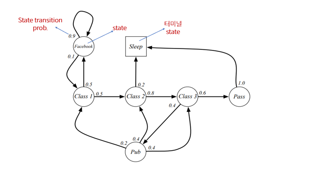
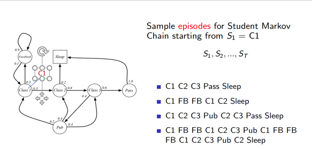
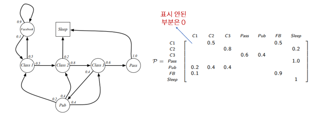
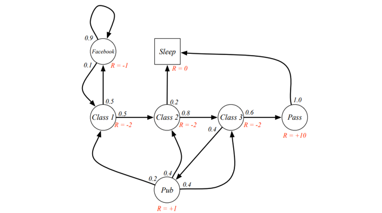

## Lecture 2. Markov Decision Processes
---

## 목 차
[1. Markov Processes]()  
[2. Markov Reward Processes]()  
[3. Markov Decision Processes]()  
[4. Extensions to MDPs]()

## 1. Markov Processes
### Introduction
- MDP(Markov Decision Processes)는 강화학습에서 환경(environment)를 묘사함
- MDP에서 환경은 fully observable 함
- 즉, 현재 state는 프로세스를 특성화(characterise)
- 대부분의 강화학습 문제는 MDP로 정의할 수 있다.
  - 최적 제어 문제 -> Continuous MDP
  - Partially observable problem -> MDP로 변환가능
  - 한 개의 state를 가지는 슬롯머신(bandit)

### Markov Property
- 정의 : state $S_t$는 다음 조건을 만족할 때(iif) `Markov`라고 한다.
$$P[S_{t+1} | S_t] = P[S_{t+1} | S_1, ..., S_t]$$

    - 즉, 미래의 state가 현재 state에만 의존하고, 과거 state에는 독립이다.
    - 따라서 현재 state만 알면 history는 미래 state 예측에 필요하지 않다.

- Markov state $s$, 그리고 이어지는 state $s'$가 있다면 *state transition prob.*는 다음과 같이 정의된다.

$$P_{ss'} = P[S_{t+1} = s' | S_t = s]$$

예를 들어 전체 state가 $n$개 있다면, transition prob.는 행렬 형태로 나타낼 수 있으며, 이를 `state transition mat.`라고 한다. 모든 state $s$에 대해, 이어지는 state $s'$의 transition prob.를 나타낸 것이다.
$$\begin{bmatrix}P_{11}&...&P_{1n}\\ \vdots&&\\P_{n1}&...&P_{nn} \end{bmatrix}$$
    * 여기서 각 row의 합은 1이다.

### Markov Process
- 정의 : Markov Process는 $<S, P>$로 표현된다. 여기서
  - $S$는 유한한 개수의 state 집합(set)
  - $P$는 state transition matrix
    - $P_{ss'} = P[S_{t+1} = s' | S_t = s]$

- Markov Process는 `memoryless random process`이다. 
- 즉, Markov Property를 가지는 랜덤 state의 시퀀스이다. ($S_1, S_2, ...$)

- Example : Student markov chain

- 에피소드 : 특정 state에서 시작해서 터미널 state까지의 시퀀스
  - MP는 여러 종류의 에피소드를 샘플링 가능

각 state간 transition prob.는 행렬로 표현 가능

## 2. Markov Reward Process
### Markov Reward Process
- 정의 : Markov Reward Process는 $<S, P, R, \gamma>$로 표현된다. 여기서
  - $S$는 유한한 개수의 state 집합(set)
  - $P$는 state transition matrix, $P_{ss'} = P[S_{t+1} = s' | S_t = s]$
  - $R$은 reward function, $R_s = E[R_{t+1} | S_t = s]$
    - $R_s$는 state $s$에서 받게되는 리워드($R_{t+1}$ 노테이션에서 알 수 있듯이, state를 떠날때 리워드를 받는다.)
  - $\gamma$는 discount factor, $\gamma \in [0, 1]$

- Exaple : Student MRP
  - MP와 비교했을 때 state에 리워드가 추가된 형태

### Return
- 정의 : return $G_t$는 time-step $t$에서 경로 구간 동안 받게되는 discounted reward의 총합이다.

$$G_t = R_{t+1} + \gamma R_{t+2} + ... = \sum_{k=0}^{\infty}\gamma^k R_{t+k+1}$$
- discount $\gamma$로 미래의 reward의 현재 가치를 나타낸다.
- $\gamma$가 0에 가까우면 근시안적(myopic), 1에 가까우면 멀리봄

- discount가 있으면 
  - 1보다 작은 값으로 설정하면 리턴이 수렴하므로 수학적인 계산이 편하다.
  - 모든 시퀀스의 termination이 보장되면 1로 설정해도 된다.

