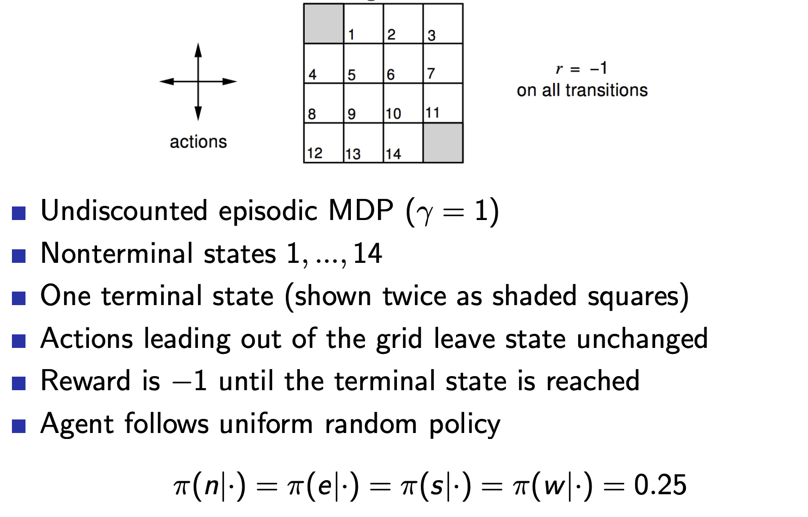

## Lecture 3. Planning by Dynamic Programming
---

## 목 차
[1. Introduction]()  
[2. Policy Evaluation]()  
[3. Policy Iteration]()  
[4. Value Iteration]()

## 1. Introduction
- Dynamic Programming : 복잡한 최적화 문제를 해결하는 데 적합
  - 해결할 문제를 subproblems로 분홰함
  - subproblems를 풀고, 그 결과를 조합한다.

- DP requirements : 다음 두가지 특징을 가진다.
  - Optimal substructure : 최적화 문제가 subproblems로 분해 가능해야함
  - Overlapping subproblems
    - subproblems는 반복적으로 풀어지며, 그 결과는 저장되었다가(cached) 재사용된다.
- MDP는 위 두 조건을 만족한다.
  - 벨만방정식은 반복적으로 분해하는 방식을 적용할 수 있다.
  - value function은 저장되었다가 재사용된다.

- DP는 MDP에 대한 모든정보(full knowledge)를 알 수 있다고 가정한다.
- 이를 활용해서 MDP의 planning에 사용한다. : prediction, control
- Prediction : MDP에서 policy를 알때, $v_\pi$를 예측 
  - 입력 : MDP $<S, A, P, R, \gamma>$, 그리고 policy $\pi$
  - 입력을 다르게 표현하면... MRP $<S, P^\pi, R^\pi, \gamma>$
  - 출력 : value function $v_\pi$
- Control : MDP에서 $\pi_{*}$를 찾기
  - 입력 : MDP $<S, A, P, R, \gamma>$
  - 출력 : optimal value function $v_{*}$, optimal policy $\pi_{*}$

## 2. Policy Evaluation
ch2에서 배웠던 bellman expectation eq.를 반복 연산하여 policy를 평가할 수 있다. 이때 과거에 계산된 value를 저장해두었다가 다음에 계산할 떄 사용하는 backup 방식을 사용한다.
### Iterative Policy Evaluation
- 문제 정의 : policy $\pi$가 주어졌을 때, 평가하기($v_\pi$를 예측)
- 해결 방법 : Bellman expectation backup을 반복 적용
- $v_1 \rightarrow v_2 \rightarrow ... \rightarrow v_\pi$ ???
- Synchronous backup : state-action pair에 대한 value를 계산할 때 동기적(순차적)으로 진행하는방법. 비동기 방법은 병렬로 진행. 병렬진행은 진행속도가 빠르지만 일부 state-action pair가 영향을 받을 수 있기 때문에 불안정할수도...
  - at iteration step $k+1$에서
  - 모든 state $s \in S$에 대해서
  - 이전 iteration step에서 계산/ 저장되었던 $v_k(s')$를 사용해서, $v_{k+1}(s)$를 업데이트함
  - 여기서 $s'$는 $s$의 다음 state를 의미함
  - 뒷부분에서 $v_\pi$의 수렴을 증명함...

- 위 그림을 보면 현재 iterative step $k+1$에서,
- $v_{k+1}(s)$을 업데이트 하기위해,
- 이전 iterative step $k$에서 계산된, sucessor state $s'$의 value function $v_k(s')$를 사용한다.

### Example : Small Gridworld
랜덤 policy를 가질때의 각 state의 value 평가하기

## 3. Policy Iteration
앞에서는 주어진 policy를 바탕으로 value 를 예측(평가)했다.
MDP만 주어졌을 때, policy를 최적화하는 방법이 있을까?
-> **policy iteration**

