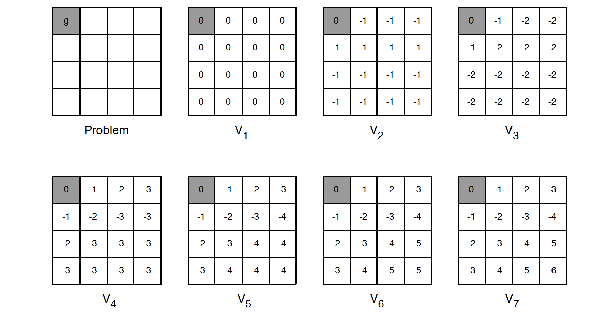
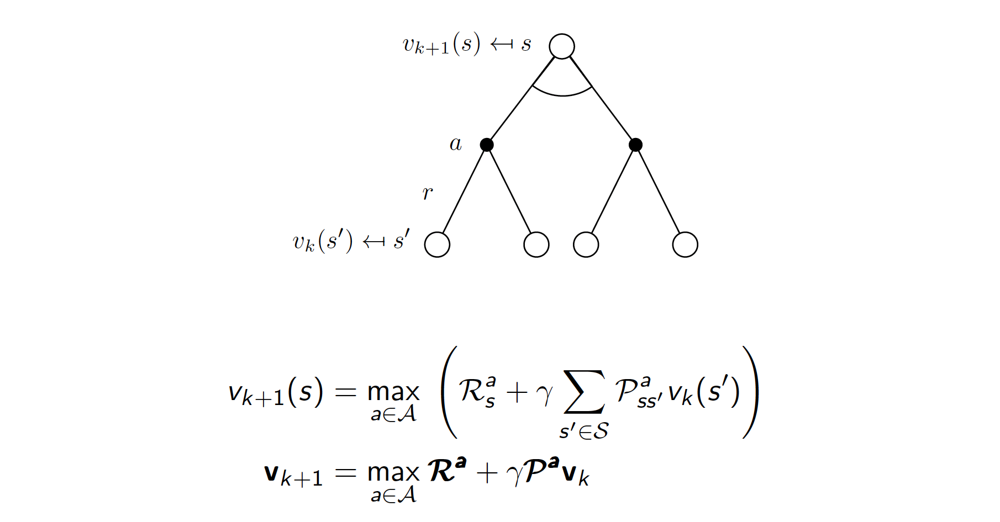
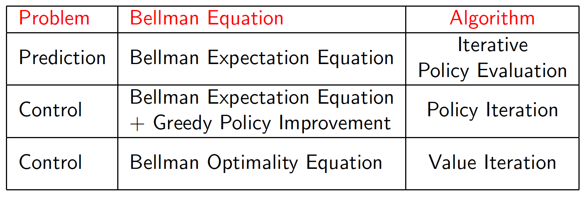
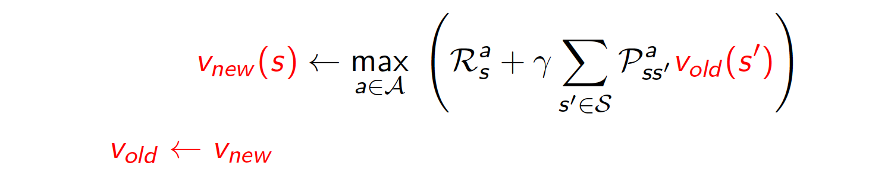

## Lecture 3. Planning by Dynamic Programming
---

## 목 차
[1. Introduction]()  
[2. Policy Evaluation]()  
[3. Policy Iteration]()  
[4. Value Iteration]()
[5. Extensions to Dynamic Programming]()

## 1. Introduction
- Dynamic Programming : 복잡한 최적화 문제를 해결하는 데 적합
  - 해결할 문제를 subproblems로 분홰함
  - subproblems를 풀고, 그 결과를 조합한다.

- DP requirements : 다음 두가지 특징을 가진다.
  - Optimal substructure : 최적화 문제가 subproblems로 분해 가능해야함
  - Overlapping subproblems
    - subproblems는 반복적으로 풀어지며, 그 결과는 저장되었다가(cached) 재사용된다.
- MDP는 위 두 조건을 만족한다.
  - 벨만방정식은 반복적으로 분해하는 방식을 적용할 수 있다.
  - value function은 저장되었다가 재사용된다.

- DP는 MDP에 대한 모든정보(full knowledge)를 알 수 있다고 가정한다.
- 이를 활용해서 MDP의 planning에 사용한다. : prediction, control
- Prediction : MDP에서 policy를 알때, $v_\pi$를 예측 
  - 입력 : MDP $<S, A, P, R, \gamma>$, 그리고 policy $\pi$
  - 입력을 다르게 표현하면... MRP $<S, P^\pi, R^\pi, \gamma>$
  - 출력 : value function $v_\pi$
- Control : MDP에서 $\pi_{*}$를 찾기
  - 입력 : MDP $<S, A, P, R, \gamma>$
  - 출력 : optimal value function $v_{*}$, optimal policy $\pi_{*}$

## 2. Policy Evaluation
ch2에서 배웠던 bellman expectation eq.를 반복 연산하여 policy를 평가할 수 있다. 이때 과거에 계산된 value를 저장해두었다가 다음에 계산할 떄 사용하는 backup 방식을 사용한다.
### Iterative Policy Evaluation
- 문제 정의 : policy $\pi$가 주어졌을 때, 평가하기($v_\pi$를 예측)
- 해결 방법 : Bellman expectation backup을 반복 적용
- $v_1 \rightarrow v_2 \rightarrow ... \rightarrow v_\pi$ ???
- Synchronous backup : state-action pair에 대한 value를 계산할 때 동기적(순차적)으로 진행하는방법. 비동기 방법은 병렬로 진행. 병렬진행은 진행속도가 빠르지만 일부 state-action pair가 영향을 받을 수 있기 때문에 불안정할수도...
  - at iteration step $k+1$에서
  - 모든 state $s \in S$에 대해서
  - 이전 iteration step에서 계산/ 저장되었던 $v_k(s')$를 사용해서, $v_{k+1}(s)$를 업데이트함
  - 여기서 $s'$는 $s$의 다음 state를 의미함
  - 뒷부분에서 $v_\pi$의 수렴을 증명함...

- 위 그림을 보면 현재 iterative step $k+1$에서,
- $v_{k+1}(s)$을 업데이트 하기위해,
- 이전 iterative step $k$에서 계산된, sucessor state $s'$의 value function $v_k(s')$를 사용한다.

### Example : Small Gridworld
랜덤 policy를 가질때의 각 state의 value 평가하기

## 3. Policy Iteration
앞에서는 주어진 policy를 바탕으로 value 를 예측(평가)했다.
MDP만 주어졌을 때, policy를 최적화하는 방법이 있을까?
-> **policy iteration**

앞에서 policy evaluation 후 greedy policy를 선택하면 그것이 optimal policy였다. 이를 활용해서 policy를 개선할 수있다.

- 주어진 policy $\pi$에 대하여
  - 1) policy $\pi$를 평가한다.(value function을 찾는다.), 즉 다음을 계산한다.
$$v_\pi(s) = E[R_{t+1}+\gamma R_{t+2} + ... | S_t = s] $$
  - 2) $v_\pi$에 대하여 greedy하게 동작하도록 policy를 수정(개선)한다.

$$\pi' = greedy(v_\pi)$$

앞의 small gridworld 문제에서 개선된 폴리시는 optimal이었다.$\pi'=\pi*$ 일반적으로는 더많은 iteration작업이 필요할 수 있다. 이러한 **policy iteration** 작업은 항상 $\pi*$로 수렴하도록 한다.

다음은 poicy iteration을 수행하면 optimal policy로 수렴하는지에 대한 증명이다.

### Extensions to Policy Iteration : Modified Policy Iteration
- 앞의 gridworld 문제에서 $k=3$ 정도에서 $\pi*$를 찾았다. iteratioin을 할 때 $v_\pi$를 수렴 시킨 후 다음을 진행해야할까?
- 아니면 stopping condition을 도입해서 진행시키면 될까(ex: e conversions of value function
- 또는 단순하게 $k$번 iterative policy evaluation을 진행 후 다음으로 넘어가면 될까?
- policy evalueaton을 한번만 진행하고($k=1$), policy를 업데이트 하는 것은 어떨까?
  - 사실 이것이 **value iteration**이다.

## 4.Value Iteration
### Value iteration in MDPs

- 모든 optimal policy 는 두가지 컴포넌트로 나눌수 있다.
  - optimal first action $A*$
  - 다음 state $S'$로부터 진행되는 optimal policy

- 정리 : Principal of Optimality
- policy $\pi(a|s)$는 state s에서 다음 조건에서만 optimal value function $v_\pi(s) = v_*(s)$를 달성한다.(if and only if)
  - s에서 어떤 state s'에 도달할 수 있어야 한다.
  - s'에서 $\pi$가 optimal value를 달성할 수 있어야 한다.
$$v_\pi(s') = v_*(s')$$

#### Deterministic Value Iteration
- 여기서는 policy는 고려하지 말자. value 만 생각해보자.
- 우리가 앞에서 구분한 두개 문제 중에서 두번째 subproblem의 solution $v_*(s')$을 안다면,
- 한스텝 앞에서 내다보고 solution $v_*(s)$를 구할 수있다.

- value iteration의 개념은 이 업데이트를 반복 수행하는 것이다.
- 직관적으로 final rewards에서 시작해서 역순으로 진행하면 될 것 같다.
- 그러나 여전히 루프 작업을 진행하고, stochastic MDP이다..??

정리하면,
- policy iteration은 Bellman Expectation Eq.를 사용했다.
- value iteration은 Bellman Optimality Eq.를 사용했다.??

이제 Value Iteration 알고리즘을 정리해보자.
#### Value Iteration
- 문제: optimal policy $\pi$ 찾기(앞의 policy iteration)과 같음
- 해법: 반복적으로 **Bellman Optimality backup**을 적용
- $v_1 -> v_2 -> ... -> v_*$
- Using synchronous backups (모두 업데이트...)
  - 각 iteration step $k+1$
  - 모든 states $s \in S$에 대하여
  - $v_k(s')$를 활용하여 $v_k+1(s)$를 업데이트

- 뒤에 $v_*$로 수렴함을 증명함
- policy iteration과 달리 policy를 사용안함

위 예에서 $k+1$ 스텝에서 $v_{k+1}(s)$을 계산하기 위해서 $s$에서 $a$라는 액션을 취했을 때의 리워드의 최대 값 max $R^a$와 이전 스텝 k에서 계산된 다음 state $s'$의 value $v_k(s')$의 값을 추가한다.  

#### Synchornous DP Algorithm Summary

지금까지 prediction을 위해 사용되는 Policy Evaluation, 그리고 최적의 policy를 찾는 control 문제를 위한 Policy Iteration/ Value Iteration 두가지 알고리즘을 살펴보았다. 이 방법은 동기(Synchronous) 기반으로 매 step에서 모든 state를 업데이트(백업)하는 방식이다.
- 즉 각 반복 스텝에서 $v_\pi (s)$, $v_* (s)$를 계산하는 방식이다.
- n개 state에 m개 action이 존재한다고 가정하면 반복 스텝마다 계산 복잡도가 $O(mn^2)$이 된다.
- action value function $q_\pi (s, a)$, $q_* (s, a)$를 사용할수도 있다.
- 이때는 반복 스텝마다 계산 복잡도가 $O(m^2n^2)$이 된다.

## 5. Extensions to Dynamic Programming
동기(Synchronous) 기반 방법은 계산 복잡도가 높다. 이에 대한 대안으로 Asynchronous DP가 제안되었다.
### Asynchronous DP
- 지금까지 설명한 DP 방법은 synchronous backups 기반이다.
- 다시 말하면 매 스템마다 모든 state가 병렬로 업데이트(백업)된다.
- 비동기 DP는 매 스텝에서 state를 개별적으로 업데이트하고 순서도 고려하지 않는다.??(in any order)
- 반복 스텝에서, 업데이트할 state가 선택되면, 적절한 업데이트(백업) 방법이 적용된다.
- 계산량을 줄일수 있다.
- 반복 스텝을 통해서 모든 state가 선택된다면 수렴이 보장된다.

비동기 DP에는 간단한 세가지 알고리즘이 있다.
- In-place DP
- Prioritesed sweeping
- Real-time DP

#### In-place DP
- 동기기반 value iteration 방법은 두개의 value function 저장공간이 필요하다.
  - $v_{old} (s)$, 그리고 $v_{new} (s)$

- In-place DP는 하나의 value function 저장공간만 사용한다. 대신 모든 s 업데이트???

#### Prioritised Sweeping
- 이전 스텝에서 Belleman error가 큰 것이 중요도가 높다고 간주하여 우선적으로 업데이트 하는 방식이다. 예를 들면 다음 식을 사용할 수 있다.

- state 업데이트(백업)은 Bellman error가 큰 것부터 진행한다.
- 업데이트(백업) 후에 영향 받은(업데이트된) state 드른 Bellman error도 업데이트한다.
- Requires knowledge of reverse dynamics (predecessor states)
- priority queue 관리를 통해 효율적으로 구현할 수 있다.

#### Real-Time DP
- 에이전트를 활용하여 에이전트가 경험한(움직이는?) state 들만 업데이트하는 방식이다.
- 에이전트가 매 타입스템마다 다음을 진행하고 $S_t$, $A_t$, $R_{t+1}$
- state $S_t$에서의 value를 업데이트 하는 방식이다.

### Full-width and sample backup
#### Full-Width Backups
- DP는 full-width backup을 사용한다.
- 매 업데이트(backup) 마다(동기든 비동기든)
  - 모든 다음 state와 action이 고려된다.
  - 이떄 MDP transition과 reward functin의 지식이 사용된다.
- DP는 medium-sized 문제(100만개 정도 state)에 효과적이다.
- 큰 문제에서 DP를 사용하면 차원의 저주에 빠지게 된다.
  - Number of states $n = |S|$ grows xponentially with number of state variables
- 심지어 업데이트(백업) 계산비용이 크다...

#### Sample Backups
- 이후 강의에서는 **Sample backup**에 대해서 배울 것이다.
- reward function *R*, transition dynamics *P* 대신이 방법에서는 sample rewards, sample transitions를 사용한다.
  - $<S, A, R, S'>$

- 장점
  - Model-free : MDP에 대한 정보가 필요없다.
  - 샘플링을 사용하므로 차원의 저주 영향이 적다
  - 업데이트(백업) 비용이 상수이다. $n = |S|$에 독립이다.

### 정리
- 
