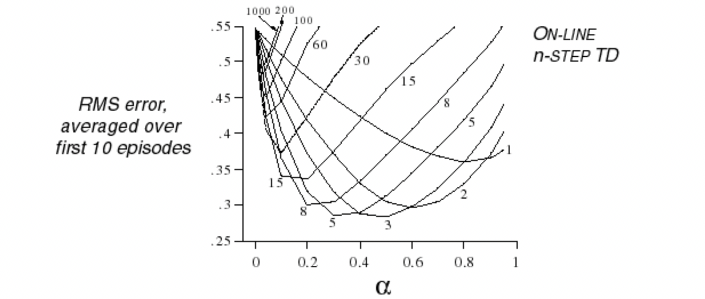
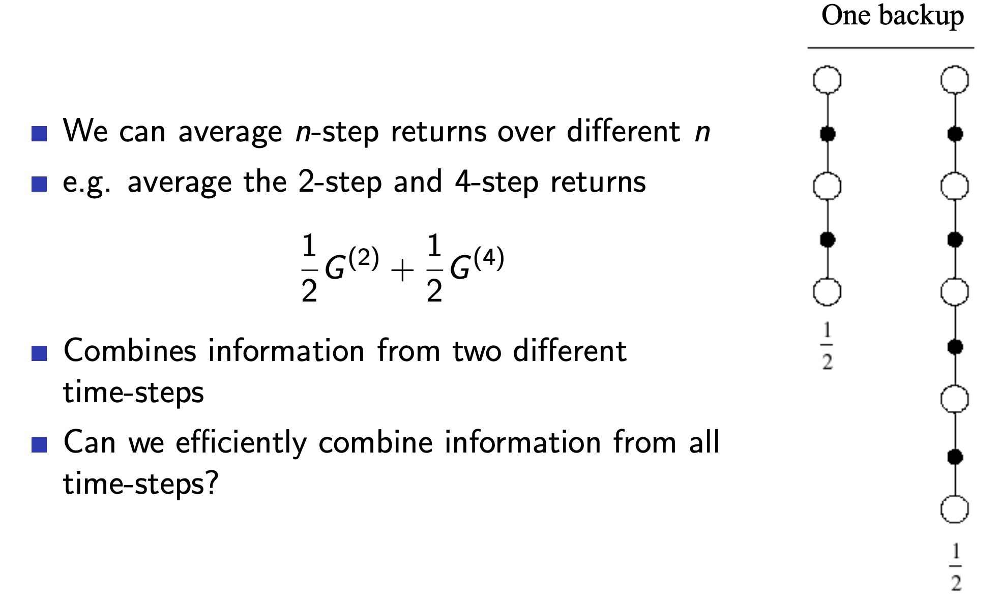

## Lecture 4. Model-Free Prediction
---

## 목 차
[1. Introduction]()  
[2. Monte-Carlo Learning]()  
[3. Temporal-Difference Learning]()  
[4. TD($\lambda$)]()

## 1. Introduction
지금까지 공부한 내용을 정리해보자.
- ch2 : MDP 설명
- ch3 : MDP를 알고 있을 때 다음 문제를 Dynamic Programming으로 푸는 방법
  - prediction : value evaluation
  - control : policy improvement

본장에서는 **MDP를 모를 때 prediction 해결 방법**에 대해 배운다.  
다음장에서는 **MDP를 모을때 control 해결 방법**에 대해 배운다.

Model-Free prediction 방법에는 다음 두가지가 있다.
- Monte-Carlo
- Temporal-Differnce

## 2. Monte-Carlo Learning

Model-Free prediction에서는 policy가 정해져 있다. 따라서 MC 방법은 Emperical하게 action을 가해보고, 취득된 리턴을 구해서 평균을 취하는 방법이다.
- 직접 에피소드 경험을 통해 확습한다.
- Model-Free : MDP의 transition이나 리워드에 대한 지식이 필요없다.
- 에피소드가 끝난 후 학습한다.(?) : 예측 값을 이용해 또 다른 값을 예측하는 부트스트래핑 방식이 아니다.(?) 
  - 참고: 부트스트래핑을 사용하면 bias는 커지고 variance는 낮아짐
- `value = 평균 return`이라는 간단한 아이디어를 사용 
- 주의 : epsodic(에피소드가 종료되는) MDP에서만 MC를 사용할 수있다.
  - All episodes must terminate

### MC 를 사용한 Policy Evaluation(Prediction)
- 목표: 주어진 policy $\pi$ 에 따라 에피소드를 실행하여 취득한 $v_{\pi}를 학습. 예를 들어 state S에서 액션 A를 취했을 때 리턴 R을 모두 취득하고...

- 리턴 계산식은 다음과 같고...

- value function은 return의 기대값으로 다음과 같으니까...
 

 - MC policy evaluation 방법은 **예측 값**이 아니라 경험으로 구한 평균(**emperical mean**)을 사용한다.
 - 대표적인 MC 방법에는 다음 두가지가 있다.  
   - First-Visit 
   - Every-Visit 

### First-Visit MC Policy Evaluation
$v_\pi(s)$를 업데이트 할 때 처음 $s$를 방문한 케이스만 고려하는 방법이다.
예를 들어
- 에피소드를 진행하면서 state $s$를 **처음** 방문한 시점에
- 방문 카운터를 증가 시켜줌 $N(s) \leftarrow N(s)$  
- 확인된 리턴을 더해줌 $S(s) \leftarrow S(s) + G_t$
- 평균을 취해서 리턴을 계산 $V(s) = S(s) / N(s)$
- $N(s)$가 무한으로 가면 $V(s)$는 $v_\pi (s)$에 수렴한다.
  - $V(s) \rightarrow v_\pi(s)$ as $N(s) \rightarrow \infin$

### Every-Visiti MC Policy Evaluation
반면 Every-visit 방법은 에피소트 안에서 state $s$를 여러번 방문하면 모두 고려한다.
예를 들어
- 에피소드를 진행하면서 state $s$를 방문할 때마다(Every time-step)
- 방문 카운터를 증가 시켜줌 $N(s) \leftarrow N(s)$  
- 확인된 리턴을 더해줌 $S(s) \leftarrow S(s) + G_t$
- 평균을 취해서 리턴을 계산 $V(s) = S(s) / N(s)$
- $N(s)$가 무한으로 가면 $V(s)$는 $v_\pi (s)$에 수렴한다.
  - $V(s) \rightarrow v_\pi(s)$ as $N(s) \rightarrow \infin$

참고 : First-visit, Every-visit 어떤 것을 써도 결과는 유사하다.??

### Blackjack Example
- state 수 : 200
  - 현재 합계 : 12 ~ 21
  - 딜러가 보여주는 카드 : ace ~ 10
  - ace 보유 여부 : yes or no

- action
  - stick : 카드받기 멈춤 (그리고 에피소드 종료)
  - twist : 카드받기

- reward  
  - stick
    - 카드 숫자 합계 > 딜러 카드 숫자 합계 : +1
    - 카드 숫자 합계 = 딜러 카드 숫자 합계 : 0
    - 카드 숫자 합계 < 딜러 카드 숫자 합계 : -1

  - twist
    - 카드 숫자 합계 > 21 : -1 (그리고 에피소드 종료)
    - 그외에 0

- transition : 카드 숫자 합계가 12보다 작으면 자동으로 twist

다음과 같은 policy로 에피소드를 진행하고 value를 계산하였다.
- policy
  - stick : 카드 숫자 합계가 20이상 일때
  - twist : 그외

약 500,000번 에피소드를 진행하고 MC 기반으로 value를 평가했다.

### Incremental Mean
MC에서는 매 step마다 방문한 state의 리턴을 확인한 후 평균을 취한다. 그런데 평균을 아래와 같이 표현할 수 있다.

즉, 이전 스텝의 결과에 최근 계산한 오차만큼 업데이트 시키는 형태로 표현할 수있다.

이것을 MC 업데이트에 반영하여 표현하면 아래와 같다.

- 에피소드($S_1, A_1, R_2, ..., S_T$) 종료후에 $V(s)$ 업데이트를 하는데
- 리턴 $G_t$로 확인된 각 state $S_t$에 대해서 다음과 같이 업데이트한다.

위에서 $(G_t - V(S_t))$가 에러 텀이다.  
그런데 스텝이 증가할수록 $N(S_t)$ 가 커지고 업데이트 할때 에러텀의 영향이 작아진다.

- non-stationary 문제에서는 시간이 지남에 따라 MDP가 바뀐다. 따라서 최근의 업데이트가 중요하다. 이때는 에러텀 앞의 계수를 $\alpha$와 같은 상수로 고정시킬수도 있다.

## 3. Temporal-Difference Learning
TD의 특징은 다음과 같다.

- 직접 에피소드 경험을 통해 확습한다.
- Model-Free : MDP의 transition이나 리워드에 대한 지식이 필요없다.(여기까지는 MC와 같음)
- 부트스트래핑을 사용해서 **에피소드가 종료되지 않아도** 학습가능
- 예측 값으로 예측 값을 계산한다.

### MC와 TD 비교
policy $\pi$가 주어진 상황에서 경험을 통해 $v_\pi$를 온라인으로 학습하기 위해 

- **Incremental every-visit MC**
  - 실제 리턴 $G_t$를 취득해서 value $V(S_t)$를 업데이트 한다.
  - 다시말해 MC 는 $G_t$ 방향으로 업데이트...

- **Simplest TD : TD(0)**
  - estimated return $R_{t+1} + \gamma V(S_{t+1})$을 통해 value $V(S_t)$
  - 다시말해 TD는 $R_{t+1} + \gamma V(S_{t+1})$ 방향으로 업데이트...

  - 여기서 $R_{t+1} + \gamma V(S_{t+1})$을 **TD target**이라고 한다.
  - $\delta_t = R_{t+1} + \gamma V(S_{t+1}) - V(S_t)$을 **TD error**라고 한다.
  - 즉 TD는 다음 스텝 $S_{t+1}$까지 이동해보고 $V(S_{t+1})$을 업데이트한다. 즉 이 한 스텝(state이동) 만큼 실제를 반영한다고 할 수있다. 이 스텝 차이 때문에 TD 알고리즘이라고 한다.

### Driving Home Example
TD는 예측 값을 사용해서 예측을 하는데 업데이트가 가능할까?  
MC와 TD의 업데이트 방식 차이를 아래 예제를 통해 살펴보자.  

이 문제는 사무실에서 집까지 이동하는데 전체 소요시간(total travel time)을 예측하는 문제이다. 
- 에피소드가 완료되면 MC는 정확한 소요시간을 알기 때문에 전체 스테이트에서 소요시간을 43으로 업데이트한다.
- TD는 다음 state만 확인하기 때문에 다음 state의 예측 결과를 바탕으로 업데이트 한다.

### MC와 TD의 장단점

- TD는 최종 결과를 알기전에 학습이 가능하다.
  - TD는 매 스텝 이후아 온라인으로 학습이 가능하다.
  - MC는 리턴을 확인하기 전까지(에피소드가 종료될때까지) 기다려야 한다.

- TD는 최종 결과 없이 학습을 할수 있다.
  - TD는 불완전한 시퀀스로 학습이 가능하다.(imcomplete sequences)
  - MC는 완성된 시퀀스로만 학습이 가능하다.(complete sequence)
  - TD는 연속 환경(non-terminating) 환경에서 동작할 수 있다.
  - MC는 episodic(terminating) 환경에서만 동작한다.

### Bias/ Variance Trade-off
Bias/ variance 관점에서 MC, TD를 비교해보자.

- return $G_t = R_{t+1} + \gamma R_{t+2} +...+ \gamma^{T-1}R_T$는 $v_\pi(S_t)$에 대하여 unbised된 estimate이다.
  - 다시 말에 $G_t$를 지속적으로 샘플링하여 평균을 취하면 $v_\pi$에 도달한다.

- 실제 TD target  $R_{t+1} + \gamma v_\pi(S_{t+1})$는 $v_\pi(S_t)$에 대하여 unbiased estimate이다. 하지만...
- TD target  $R_{t+1} + \gamma V(S_{t+1})$는 $v_\pi(S_t)$에 대하여 biased estimate이다. 예측 값으로 예측을 진행하기 때문에...
- 하지만 TD tareget은 MC가 활용하는 return에 비해 매우 낮은 variance를 가진다
  - return은 많은 random action, transitions, rewards에 의존하기 때문이다.
  - 반면, TD target은 하나의 random action, transition, reward에만 의존한다.

앞에서 본내용을 바탕으로 MC, TD의 장단점을 정리하면 다음과 같다.

이제 다음 랜덤워크 예제를 살펴보자.  
A, B, C, D, E 5개의 터미널이 있고, E에서 오른쪽 터미널로 이동할때만 reward 1을 받는다. policy는 random이다.

각 state에서 value의 초기 값은 0이다.

아래 결과를 살펴보면 다음과 같은 특징을 알 수가 있다.  
- MC는 에피소드 진행횟수가 늘어날 수록 value 오차가 감소한다.
- 반면 TD는 에피소드가 진행횟수가 늘어나더라도 value 오차가 계속 감소하지 않을 수도 있다.
- MC에 비해서 TD에서는 상대적으로 큰 $\alpha$ 값을 사용...

### Batch MC and TD
- MC, TD  모두 에피소드 수행경험이 무한(experience $\rightarrow \infty$)으로 가면 예측 $V(s)$가 $v_\pi(s)$에 수렴하는 것을 알았다.($V(s) \rightarrow v_\pi(s)$)
- 하지만 유한한 에피소드만 경험한다고 가정할때(k번) 결과는 어떨까?

이를 이해학 위해 다음의 간단한 예제를 살펴보자.
A, B 두개의 state가 있고 8번의 에피소드를 수행했을떄의 결과가 아래와 같다.

이때 MC, TD에서 $V(A)$, $V(B)$는 어떻게 계산될까?

- MC는 mean-squared error를 최소화 하는 방향으로 수렴시킨다.
  - 다시말해 다음을 최소화 하도록..
  
  - 따라서 본예제에서 MC는 $V(A) = 0$으로 예측한다.

- TD(0)은 마코프모델의 max likelihood에 수렴한다.

  - 따라서 본예제에서 TD(0)은 $V(A) = 0.75$으로 예측한다.

이를 바탕으로 MC, TD 장단점을 추가하면...

- TD는 Markov property를 이용한다.
  - Markov 환경에서 효율적이다.

- MC는 Markov property를 이용하지 않는다.
  - non-Markov 환경에서 효과적이다.

### Bootstrapping and Sampling
Bootstrapping and Sampling 관점에서 MC, TD를 비교하면 다음과 같다.

- Bootstrapping : 추정 값으로 업데이트한다.(update involves an estimate)
  - MC는 bootstrap 사용안함
  - TD, DP는 bootstrap 사용

- Sampling : 기대값(평균)으로 업데이트한다.(update samples an expectation)
  - MC는 sampling 사용
  - DP는 sampling 사용안함
  - TD는 sampling 사용

- DP : 모델을 알고 있을때만 가능
- TD : Model free, bootstrap
- MC : Model free, sampling

## 4. TD($\lambda$)
앞에서 TD는 현재 state(s) 업데이트를 위해 해당 state의 reward와 다음 state의 밸류 추정치를 사용한다고 했다. ($R_{t+1} + \gamma V(S_{t+1})$)  
그런데 몇 state를 더 경험하고 업데이트 하면 어떨까?

### n-Step Prediction

TD target을 추정할 때 몇 state를 더 이동하느냐에 따라 TD(n)이라고 칭한다. step이 에피소드 끝지점(터미널)까지 이동하면 그것이 MC이다.  

n-step Return 계산방법은 아래와 같다.

따라서 n-step TD learning에서 state $S_t$업데이트 방법은 다음과 같다.
$$V(S_t) \leftarrow V(S_t) + \alpha (G_t^{(n)} - V(S_t))$$

그러면 step size가 클수록 빠륵게 수렴할까?  
아래 랜덤 워크 예제 결과를 살펴보자.  
$\alpha$와 step size를 다르게 설정하고 10번의 에피소드를 실행하여 RMS error를 시각화 한 것이다.

위 예에서는 TD(3), TD(5)가 낮은 오차를 보여주는 것을 알 수 있다.   
즉, 0 ~ max n 사이에 sweet spot이 존재한다.

### Averaging n-Step Return
두개의 TD를 평균내서 사용해도 된다.

그렇다면 모든 time step을 조합하는 방법도 가능할까?   
가능하다. 이것을 TD($\lambda$)라고 한다.   

### Forward View of TD($\lambda$)
TD($\lambda$)에는 Forward View, Backward View 두가지가 있는데 먼저 Forward view를 살펴본다.
이 방법은 계산된 매 스텝의 return에 가중치 (1-$\lambda) \lambda^{n-1}$를 곱하여 더하는 방법이다.
(1-$\lambda) \lambda^{n-1}$는 흔이 알려진 geometric mean인데 $n \rightarrow \infty$이면 1로 수렴한다.

즉, Forward-View TD($\lambda$)의 업데이트 알고리즘은 다음과 같다.
$$V(S_t) \leftarrow V(S_t) + \alpha (G_t^{\lambda} - V(S_t))$$

가중치의 영향으로 멀리 있는 step의 영향이 작다.  
영향을 높이가 싶으면 $\lambda$를 크게 설정하면 된다.  
$\lambda = 1$이면 MC가 된다.
geometric mean을 사용하는 이유? 계산 편하고, memory efficient 하다고 한다.  

Forward-view TD($\lambda$)는 ,
- $\lambda$ return을 통해(towards) value function을 업데이트 한다.
- $G_t^{\lambda}$ 계산을 위해 미래를 확인한다.  
- 단점 : MC처럼 에피소드가 완료되어야 계산할 수 있다.

### Backward View of TD($\lambda$)
Backward View는 과거를 보는 방식인다.  
이해를 돕기위해 책임 추적(Eligibility Traces) 예를 살펴보자.  

정전이 발생하기 전에 벨이 3번이나 울렸고, 정전 직전에 전구에 불이 켜졌다.  
- 전구에 책임이 있다면 -> 최근에 발행한 사건했다고 생각하는 것이고..
- 종에게 책임이 있다면 -> 빈번하게 발생했기 때문이라고 생각하는 것이다.. 

즉, 정리하면
- Frequency heuristic : 빈번하게 발생하는 state에 크레딧 부여
- Recency heuristic : 최근 state에 크레딧 부여

Eligibility Traces는 두 직관을 조합한 것이다.  
초기에, $E_0 (s) = 0$이고, 매 스텝이 진행하면서 다음과 같이 $E_t(s)$를 계산한다.  
$$E_t(s) = \gamma \lambda E_{t-1}(s) + 1(S_t = s)$$  

위식에서 첫번째 텀은 시간이 지나면 $\lambda$만큼 감쇠하도록 한것이고, 두번째 텀은 최근에 방문하면 1을 추가한다.   

Backward view에서는 각 state 별로 $E_t(s)$를 계산해서 가지고 있는 것이다.

$V(s)$를 업데이트할 때 TD error에 $E_t(s)$ 함께 업데이트 해준다.  
이 방법은 매 step마다 업데이트 해줄 수 있다는 장점이 있다.   
다시말해 에피소드가 끝나지 않아도 업데이트 가능한다.

### TD($\lambda$), TD(0)

Forward, Backward에서,
- $\lambda$= 0이면, TD(0)
-  $\lambda$= 1이면, TD($\lambda$)

이다.

\### TD($\\lambda$), MC

