## Lecture 5. Model-Free Control
---

## 목 차
[1. Introduction]()  
[2. On-Policy Monte_Carlo Control]()  
[3. On-Policy Temporal-Difference Learning]()  
[4. Off-Policy Learning]()

## 1. Introduction
지난 강의에서는 
- Model-free prediction
- MDP를 모를 때 value function을 추정

이번 강의에서는
- Model-free control
- MDP를 모를 때 value function을 최적화

MDP로 모델링할 수 있는 문제들을 살펴보자.

이러한 문제들은 대부분의 경우 둘중 하나이다. 
- MDP를 모르지만, experience 샘플링 가능
- MDP는 알지만, 사용하기 너무커서, 샘플링만 가능

이 경우 Model-free control을 사용할 수 있다.

### On and Off-Pollicy Learning
policy는 두가지가 있을 수 있다.  
1) target policy : 최적화하려는 policy
2) behavior policy : env에서 경험을 쌓기 위한 policy

Model-free control에서 사용할 수있는 두가지 학습법이 있다.
- On-policy learning : 1. 2.가 같을 때
  - Learn on the job : 경험을 통해 학습
  - 샘플링된 경험으로부터 policy $\pi$에 대해 학습함

- Off-policy learning : 1. 2가 다를 때
  - Look over someone's shoulder : 다른 사람(에이전트)의 어깨너머로 학습
  - 다른 에이전트의 샘플링된 경험과 폴리시 $\mu$로부터 policy $\pi$에 대해 학습함

### 일반적인 Policy Iteration
3장에서 사용한 일반적인 Policy Iteration(즉, DP)를 살펴보자.
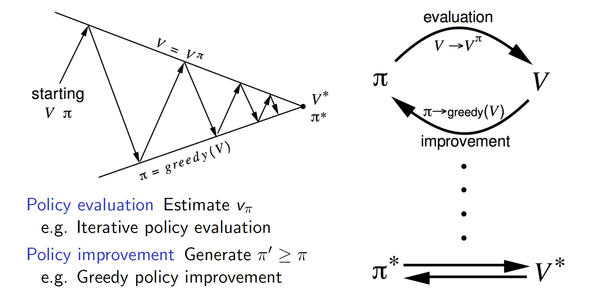

$v_\pi$를 추정하기 위한 **Policy evaluation**과, policy를 개선하기 위한 **Policy improvement** 과정을 반복했다.

그렇다면 Model-Free도 MC를 사용해서 Policy iteration을 사용하면 되지 않을까?
불가능하다.   
MDP를 모르면 다음 state가 어떻게 될지 알수 없기 때문에 greedy policy를 만들 수가 없다.   
greedy policy라는 것이, 특정 state에서 이동할 수 있는 가장 좋은 state를 선택하는 것인데, state를 모른다면 불가능하다.  

### Model-Free Policy Iteration Using Action-Value Function
앞의 내용을 정리하면,

- $V(s)$를 사용한 Greedy policy improvement 방식은 MDP 모델이 필요하다. 아래 식을 통해 policy improvement를 진행해야하기 때문이다.

- 대신 action value function $Q(s, a)$를 사용한 Greedy policy improvement 방식은 model-free이다. 다음 식을 사용하기 때문이다.

즉 action을 취해보고(action의 가지수는 알기 때문에), 리턴의 평균을 취하는 것은 가능하다.

### 일반화된 Policy Iteration with Action-Value Function
이제 **Q**를 사용해서 MC를 통한 평가를 할 수 있음을 알았다.  
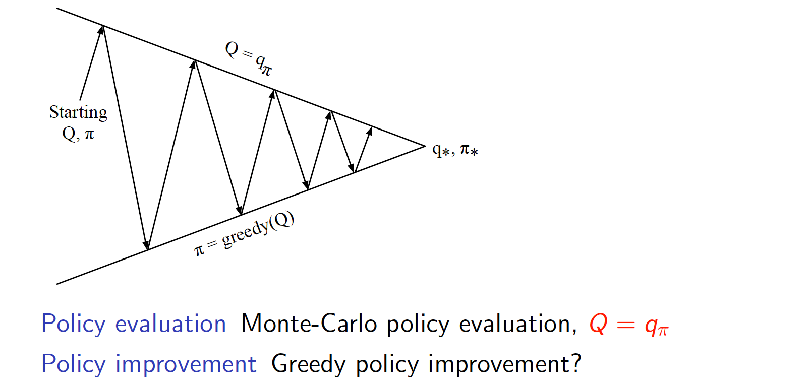

그렇다면 greedy policy improve는 가능할까?   
greedy 하면 exploration이 충분치 않다.

### Example of Greedy Action Selection
아래 그림의 예에서 처럼 두문중에 하나를 선택하는 문제에서 처음 왼쪽을 선택했을때 reward가 0이 나왔고, 이후 오른쪽 문을 세번 연속 했을때 계속 reward가 나왔다면, 오른쪽 문만 선택하려고 하지 않을까?
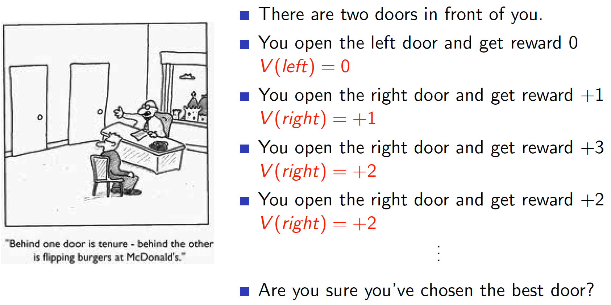

### $\epsilon$-Greedy Exploration
이러한 문제를 완화하기 이해 제안된 방법이 $\epsilon$-Greedy Exploration 방식이다.  

- non-zero probability로 시도할 수 있는 action이 $m$개 있을 때,
- $1 - \epsilon$의 확률로 greedy action을 취하고,
- \epsilon$의 확률로 greedy action을 취함
- 즉, 다음과 같이 policy를 설정

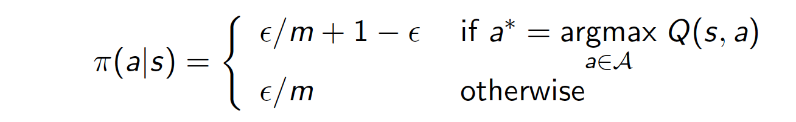

$\epsilon$을 설정할 때 모든 action을 exploration 할 수 있고, 동시에 policy가 개선될 수 있도록 해야한다.

### $\epsilon$-Greedy Policy Improvement
앞의 내용을 정리, 증명한 것이다.
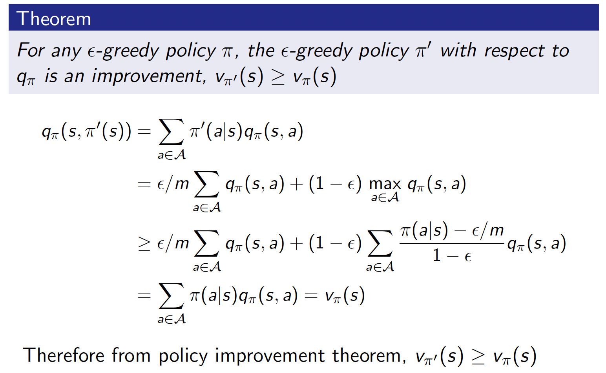

### MC Policy Iteration  
이제 Model-free에서 On-policy 기반의 MC policy interation을 정리하면 다음과 같다.  

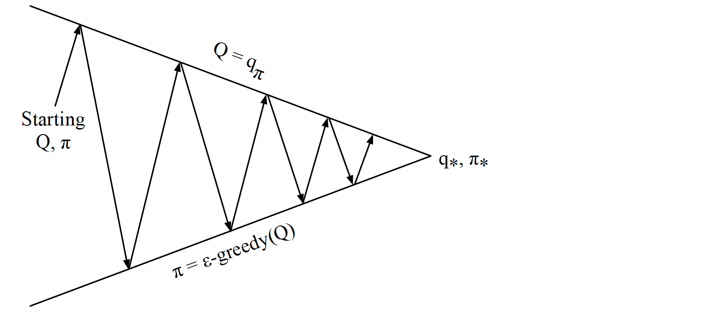
- Policy evaluation : $Q = q_\pi$를 사용한 MC policy evaluation
- Policy improvement : $\epsilon$-greedy 기반

한 에피소드를 수행한 다음에 진행하는 것도 가능하다.(속도 빠름)  
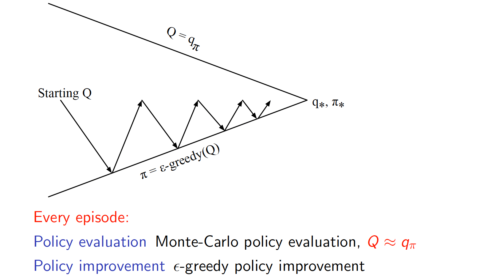

### GLIE(Greedy in the Limit with Infinite Exploration)
앞의 MC가 잘 실행되기 위한 조건이 있다.(GLIE)
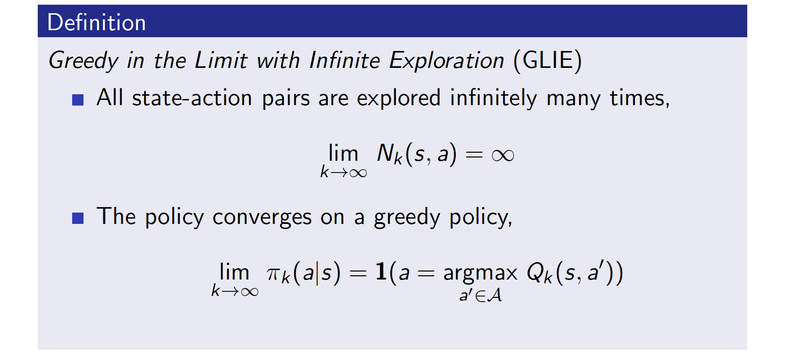
- exploration에 관한것 : 모든 state-action pair가 무한히 많이 exploration 되어야 한다.
- explot에 관한 것 : $\epsilon$ 확률 만큼 랜덤 policy가 있더라도 결국에는 greedy로 수렴해야한다.
  - 예를 들어 $\epsilon$가 $k$ 스텝에서 $\epsilon _k = 1/k$로 되도록 설정하면 GLIE를 만족한다.

### GLIE MC Control
이제 본 강의에서 나오는 첫번째 Model free control 방법에 대해 알아보자.  
바로 GLIE MC Control이다.
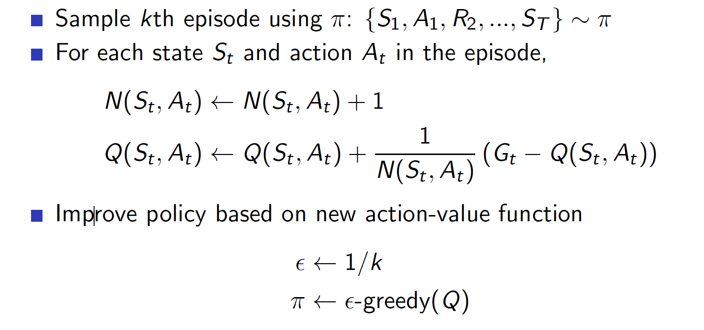
위에서 $1/N(S_t, A_t)$는 이전의 방식처럼 고정 시킬수도 있다.  
그리고 greedy-policy로 수렴하도록 하기 위해 $\epsilon$을 $1/k$로 설정한다.   

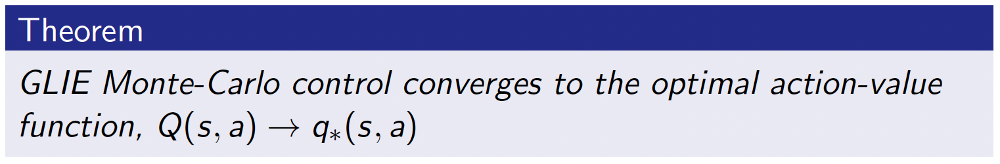

### MC Control을 사용함 블랙잭 예제
4장에서는 policy가 설정된 상태에서 각 state의 value를 prediction(evaluation) 해보았다.  
여기서는 최적의 polic를 찾아본다.   

본 문제에서 state는 3개이다.
- ACE 카드 보유여부 : 0, 1
- 딜러가 보여준 카드 (A ~ 10)
- 내카드의 합 (11 ~ 21)

아래는 MC Control로 계산한 $\pi _*$ $v_*$이다.

## 3. On-Policy Temporal-Difference Learning
### MC vs TD Control
그러면 4장에서 처럼 MC 대신 TD를 사용해되 될까?  
가능하다. TD의 장점을 활용할 수 있다.  

- TD learning은 MC와 비교했을 때 몇가지 장점이 있다.  
  - Lower variance
  - Online
  - Incomplete sequences에 사용가능

- 기본 컨셉 : 앞의 제어루프에 TD 대신 MC를 사용
  - $Q(S, A)$를 업데이트 할 때 TD 사용
  - policy improvement를 위해 $\epsilon$-greedy 사용
  - 매 time-step마다 업데이트

### Sarsa($\lambda$)
TD를 사용해서 Action-Value function을 업데이트 하는 방법인 Sarsa에 대해서 살펴보자.

- 1. state S에서 action A를 취함
- 2. reward R을 받고 state S`에 도달
- 3. state S\`에서 action A\`를 취하고 이전 스텝 테이블에 있던 $Q(S`, A`)$를 사용

Sarsa도 테이블 업데이트 방식을 사용하고, 업데이트 식은 다음과 같다.

$\alpha$ 뒤에 있는 부분은 앞에서 배웠던 TD error이다.

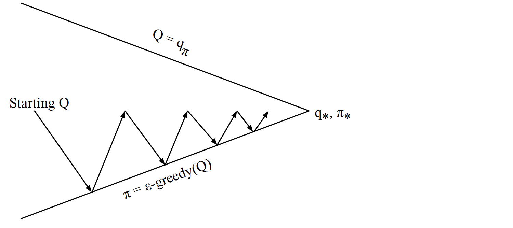

정리하면 On-Policy Control With Sarsa는,  
- 매 time-step마다
- Policy evaluation : Sarsa로 $Q \approx q_\pi$를 업데이트 하여
- Policy improvement : $\epsilon$-greedy 사용하여 policy를 improvement한다.

### Sarsa Algorithm for On-Policy Control
Sarsa 알고리즘에 대하여 더 자세히 살펴보자.
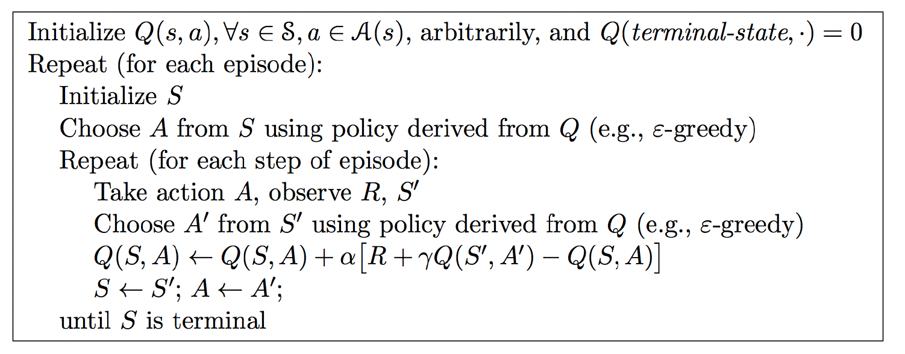
- 룩업 테이블 Q(s, a)를 초기화 한다. 그리고 Q(terminal-state, -) = 0이다.
- 각 에피소드 마다 다음을 반복:
  - S를 초기화(S에 진입)
  - 해당 S에서 Q에서 얻어진 policy를 활용해서(예: $\epsilon$-greedy) 액션 A를 선택
  - 에피소드의 각 step에서 다음을 반복:
    - 액션 A를 취하고, 리워드 R과 다음 스테이트 S\`를 확인
    - S\`에서  Q에서 얻어진 policy를 활용해서(예: $\epsilon$-greedy) 액션 A`를 선택
    - Q를 업데이트
    - 현재 스테이트, 액션을 S\`, A\`로 설정

### Convergence of Sarsa
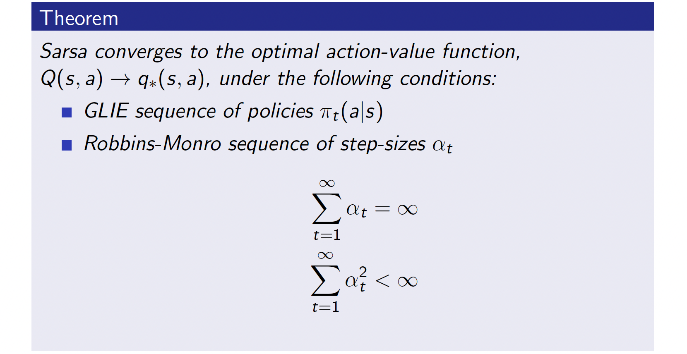
Sarsa는 다음 조건에서 optimal action-value function에 수렴한다.($Q(s, a) \rightarrow q_*(s, a)$)
- policy를 통해서 GLIE를 만족해야한다.(앞과 동일)
- step-size $\alpha _t$가 Q를 멀리까지 도달 시킬수 있도로 충분히 커야한다.(예를 들어 실제 최적 Q가 1억인데 0에서 1억까지 업데이트 시킬수 있어야 ...)

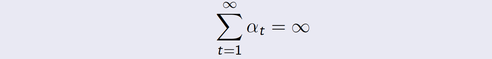

- 그러면서 $\alpha _t$는 수렴해야함

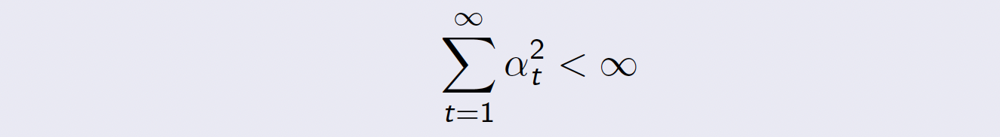

### Windy Gridworld Example

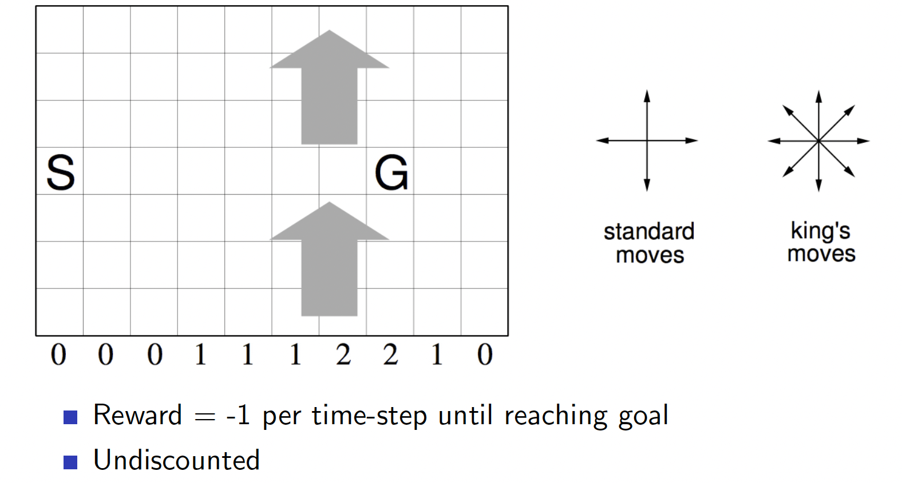

- Q 테이블은 몇개가 필요할 까 : state수 * action수 = 70*4

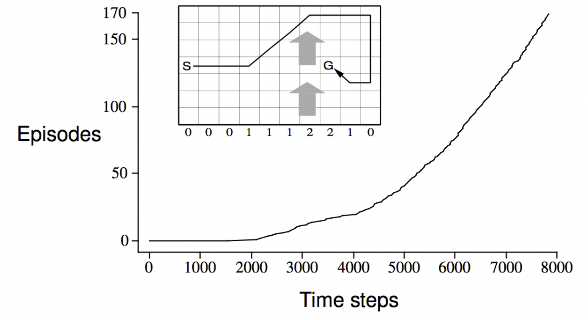
첫 에피소드는 2000 time step 정도 지나서(움직여서) 끝났다.  
그 다음 부터는 짧은 time step만으로 에피소드가 종료되기 시작함(기울기 경사가 커짐)
우연히 한번 터미널에 도착하면 정보가 전파되기 시작함...

### n-Step Sarsa
TD($\lambda$) 처럼 Sarsa도 적용이 가능할 까 -> 가능하다.
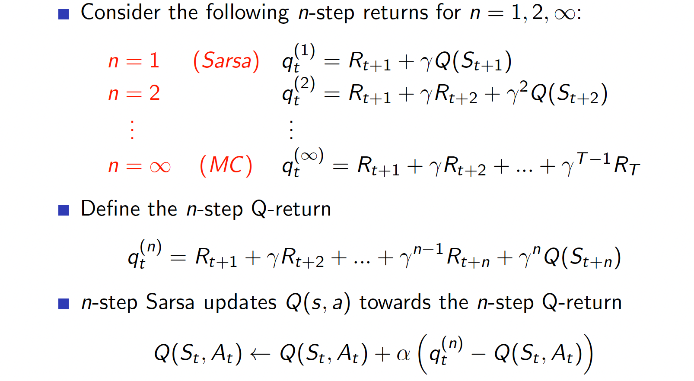

### Forward View Sarsa($\lambda$)

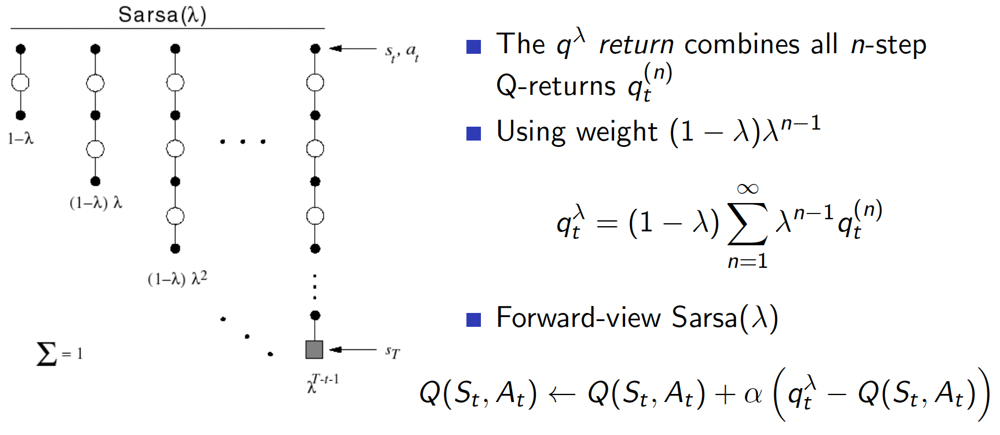

### Backward View Sarsa($\lambda$)
앞의 eligibility trace 적용한 것임

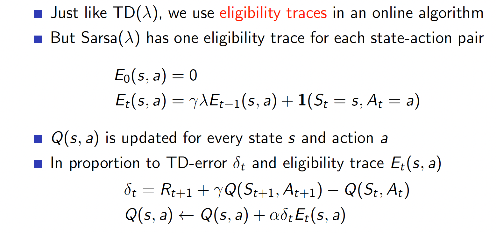

backward 알고리즘에 대해서 자세히 살펴보자.
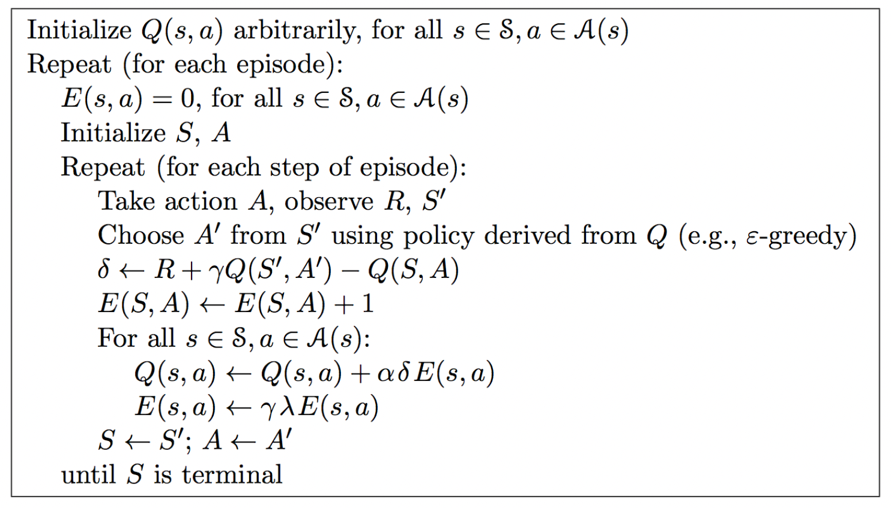

앞과 비슷한데 추가된 for loop가 하나 더 있다.
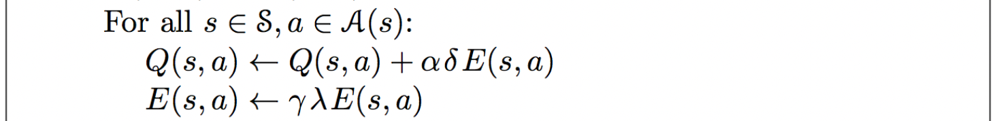

E(S, A) 업데이트 후, 모든 S, A에 대해서 Q, E 업데이트를 진행한다. (진행한 것에 대한 Eligibility Trace가 있기 때문이다.)  
즉 한번 action을 취하고 모든 S에 대해 업데이트를 취한다. 이것이 Sarsa($\lambda$)이다.  
계산량이 많지만 정보 전파가 빠르다.

### Sarsa($\lambda$) Gridworld Example
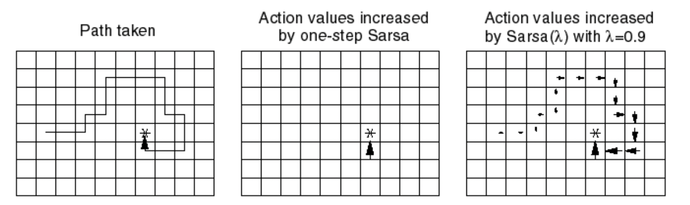

터미널에 도착하면 one-step Sarsa는 터미널에 도달하기 전 Action value만 업데이트 한다.
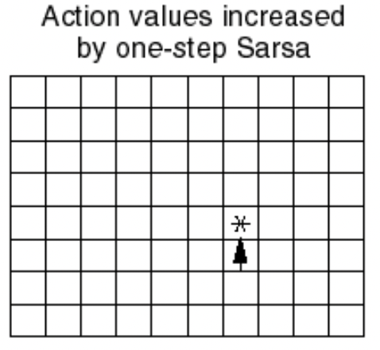

반면 Sarsa($\lambda$)는 책임을 물어서(Eligibility trace) 터미널까지 지나온 state의 Q를 모두 업데이트한다.
아래에서 터머널 부근의 화살표가 큰 이유는 최근에 방문한 것이어서 E가 크기 때문이다.

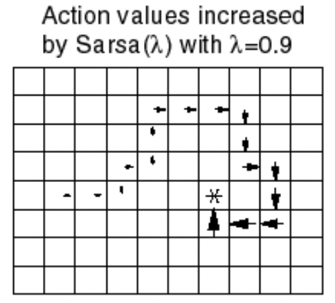

## 4. Off-Policy Learning
Off-policy learning은 behaviour policy $\mu(a|s)$와 target policy $\pi (a|s)$가 분리되어 있다.
즉, $v_\pi(s)$ 또는 $q_\pi(s)$를 계산하는데 $\pi$를 따르는 상황이 아니라 $\mu$따라 움직여야 하는 상황이다.

정리하면 Off-policy learning은
- $v_\pi(s)$ 또는 $q_\pi(s)$ 계산을 통해 최적화 하기 위한 **target policy** $\pi (a|s)$가 있고
- 실제 행위(관측)는 $\mu(a|s)$를 통해서 진행된다.

이 방식은
- 다른 사람이나 다른 에이전트 관측을 통해 배우는 방식이다.
- 과거의 policy들($\pi _1, \pi _2, ..., \pi _{t-1}$)을 통해 만들어진 경험을 재사용할 수 있다.  
- 탐험적인 행동을 하면서 최적의 policy를 학습할 수 있다.
  - Learn about **optimal policy** while following **exploratory policy**

- 한가지 policy를 따르면서 여러가지 policy들을 학습할 수 있다.
  - Learn about **multiple policies** while following **one policy**

Off-policy learning을 이해하기 위해서 두가지 개념을 이해할 필요가 있다.
- Importance smapling
- Q learing

### Importance sampling

서로 다른 확률 분포 P(X), Q(X)가 있다고 하자. 그리고 f(x)의 기대 값을 P(X)를 통해서 구하고자 한다.  
X과 확률 분포 P에서 샘플링 된 것을 통해서 구해지는 f(x)의 기대 값 $E_{X ~ P}[f(X)]$를 구하는 식은 다음과 같다.

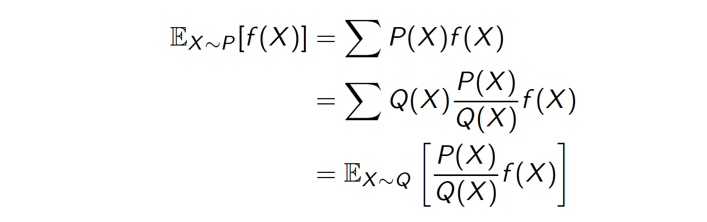

예를 들어 우리가 관심있는 주사위 각 눈의 확률 분포 P가 다음과 같을 때...
- 1: 1/6, 2: 1/6, 3: 1/6, ....

우리는 확률 분포가 Q와 같은 면이 비뚤어진 주사위를 사용한다...
- 1: 1/2, 1: 1/8

위 식은 f(X)의 기대 값을 P를 이용해서 구하고 싶은데,,,,    
다른 주사위 Q이용해서 교정만 해주면 구할 수 있다는 것을 나타낸다.  

### Importance Sampling for Off-Policy Monte-Carlo
Importance sampling 개념을 Off-policy MC에 적용해 보자.
- 최적의 $\pi$를 계산하기 위해 $\mu$를 통해서 생성된 return을 사용한다.
- 즉 $\pi$, $\mu$ 간의 유사성에 따라, $\mu$를 통해 구해진 $G_t$를 통해 다음을 게산한다.
  - 식을 보면 action 수마다 교정해주는 방식이다.

- 그리고 **corrected return**으로 V를 다음과 같이 업데이트 한다.

그런데 이 방법은 다음의 이유로 **사용이 어렵다.**
- 1. 보정식의 분모 분자텀 때문에 $\pi$가 0이 아닌데, $\mu=0$이면 사용할 수 없다.
- 2. variance가 극도로 크다.

### Importance Sampling for Off-Policy TD
TD에는 적용이 되는지 확인해보자.
- 최적의 $\pi$를 계산하기 위해 $\mu$를 통해서 생성된 TD target($R_{t+1} + \gamma V(S_{t+1})$)을 사용한다.
- TD target($R_{t+1} + \gamma V(S_{t+1})$)에 importance sampling으로 가중치를 준다.
- single importance sampling correction만 취한다.

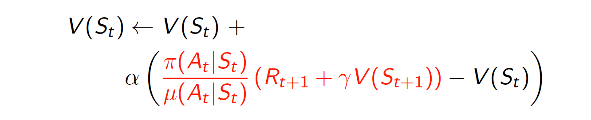

- MC importance sampling보다 variance가 작다.
- Policies only need to be similar over a single step(?)

### Q-learning
두번째 방법인 Q learning에 대해 알아보자.
- 이 방법은 action-value $Q(s, a)$를 off-policy로 학습하는 방법이다.
- 예를 들어 $S_t$에서 behaviour policy $\mu(.|S_t)$로 Action $A_{t}$이 선택되었다고 가정하자.
- 그러면 리워드 $R_{t+1}$를 받고, state $S_{t+1}$에 도착한다. 그리고 여기서 action$A_{t+1}$을 취했다고 하자. 
- 하지만 $Q(s, a)$를 업데이트 할 때 target policy $\pi (.|S_t)$ 를 통해 선택된 $A'$(Alternative successor action)를 사용하여 반영한다.
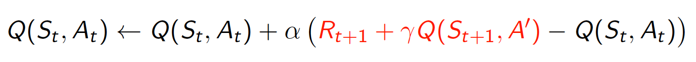

결국 $Q(S_{t+1}, A)$ 부분이 일반 TD와 차이점이다.  
lookup table을 사용하기 때문에 위와 같은 대체가 가능하다.

### Off-Policy Control with Q-Learning
이제 이 알고리즘을 상세히 살펴보자.

- 이 방법은 behaviour, target policy 둘다 **개선한다.**
- $Q(s, a)$에 대해서 greedy한 target policy $\pi$를 찾도록 한다. 

- 그리고 $Q(s, a)$에 대해서 $\epsilon$-greedy한 behaviour policy $\mu$를 찾도록 한다.

즉, target policy는 greedy하게, behaviour policy는 약간의 explore를 하게 설정한다.

정리하면 Q-learningd의 target은 다음과 같이 간단하게 정리된다.
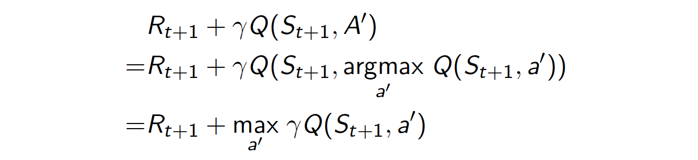

Q-learning control algorithm을 시각적으로 표현하면 아래와 같다.

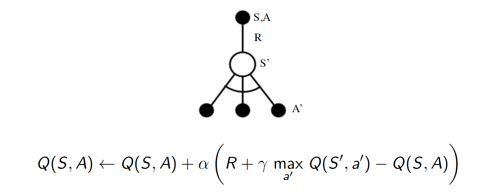

즉 state $S'$에서 취할 수 있는 action 중에 max $Q$를 만드는 action을 반영하는 것이다.

다음 정리에 따르면 Q-learning control algorithm은 optimal action-value function으로 수렴할 수 있다.

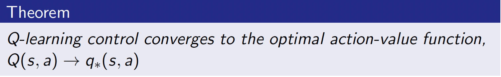

알고리즘을 정리하면 다음과 같다.

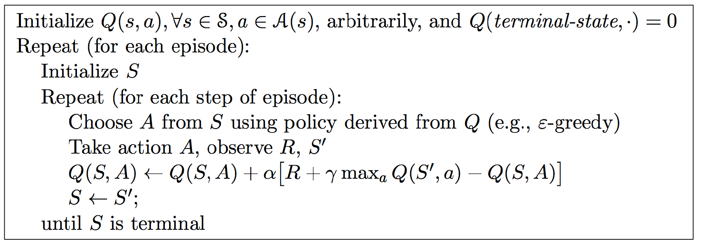

## 정리
DP와 TD 비교

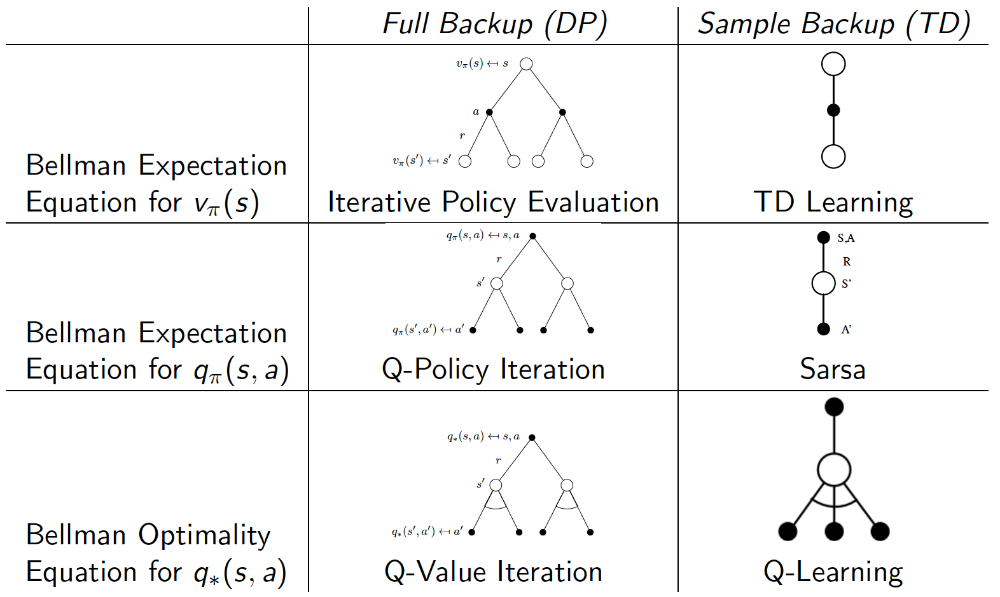

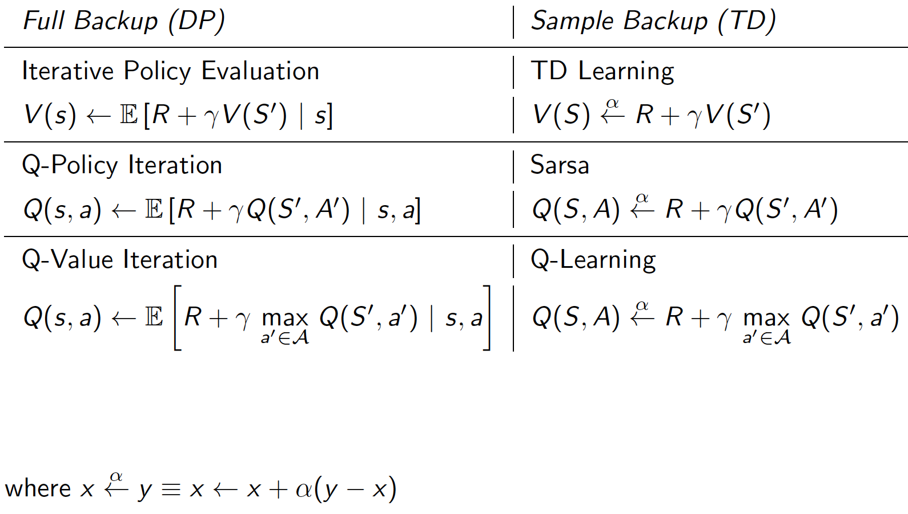