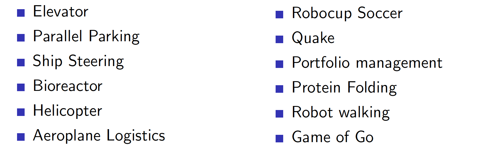

## Lecture 5. Model-Free Control
---

## 목 차
[1. Introduction]()  
[2. On-Policy Monte_Carlo Control]()  
[3. On-Policy Temporal-Difference Learning]()  
[4. Off-Policy Learning]()

## 1. Introduction
지난 강의에서는 
- Model-free prediction
- MDP를 모를 때 value function을 추정

이번 강의에서는
- Model-free control
- MDP를 모를 때 value function을 최적화

MDP로 모델링할 수 있는 문제들을 살펴보자.

이러한 문제들은 대부분의 경우 둘중 하나이다. 
- MDP를 모르지만, experience 샘플링 가능
- MDP는 알지만, 사용하기 너무커서, 샘플링만 가능

이 경우 Model-free control을 사용할 수 있다.

### On and Off-Pollicy Learning
Model-free control에서 사용할 수있는 두가지 학습법이 있다.
- On-policy learning
  - Learn on the job : 경험을 통해 학습
  - 샘플링된 경험으로부터 policy $\pi$에 대해 학습함

- Off-policy learning
  - Loo over someone's shoulder : 다른 사람(에이전트)의 어깨너머로 학습
  - 다른 에이전트의 샘플링된 경험과 폴리시 $\mu$로부터 policy $\pi$에 대해 학습함