## Lecture 6. Value Function Approximation
---

## 목 차
[1. Introduction]()  
[2. Incremental Methods]()  
[3. Batch Methods]()  

## 1. Introduction
### Large-scale RL
지금까지 우리는 Table look 기반의 방식을 소개했다.   
현실 문제는 state가 매우 많다.  
- Backgammon 보드게임 : $10^{20}$ states
- Computer 바둑 : $10^{170}$ states
- Helicopter : continuous state space

특히 헬리콥터 사례를 보면 lookup table을 만들수가 없다.

Model-free 문제를 scale up 하는 방법은 없을까?

### Value Function Approximation

- 지금까지 우리는 value function을 look up table로 표현했다.
  - 모든 state s는 V(s) 항목을 가진다.
  - 또는 state-action pair s, a는 Q(s) 항목을 가진다.

- 큰 MDP 문제에서는 
  - state나 action이 매우 많아서 메모리에 저장하지 못할 수도 있다.
  - 각 state의 value를 개별적으로 학습하는 것은 매우 느리다.

- 큰 MDP 문제 해결책
  - **function approximation**으로 value function을 추정한다.

  - 확인된 states에서 확인안된 states로 일반화한다. (Generalise from seen states to unseen states)
  - MC, TD learning으로 파라미타 $w$를 학습한다.

### Types of Value Function Approximation

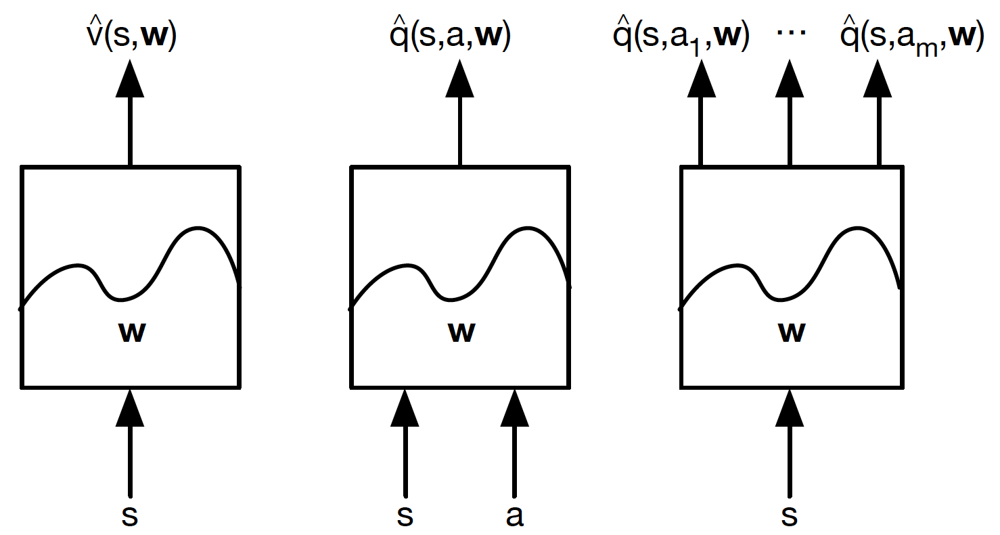

Function Approximation 방법은 몇가지가 있다.   
우선 approximator는 파라미터 w로 구성된 black boax이다.  
- 위 첫번째 : s를 입력하면 $\hat{v}(s, w)$ 가 출력됨
- 두번째 : s, a를 입력하면 $\hat{q}(s, a, w)$ 가 출력됨
- 세번째 : s를 입력하면 $\hat{q}(s, a_1, w)$ ... $\hat{q}(s, a_m, w)$가 출력됨 (즉 모든 a에 대한 것이 출력됨)

Function Approximator의 종류는 다양한다.
- Linear combinations of features
- Neural network
- Decision tree
- Nearest neighbour
- Fourier / wavelet bases
- ...

이중에서 우리는 미분 가능한 function approximator만 고려한다.
- Linear combinations of features
- Neural network

또한 non-stationary, non-iid 데이터셋에 적합한 학습 방법도 필요하다.

## 2. Incremental method
### Gradient Descent

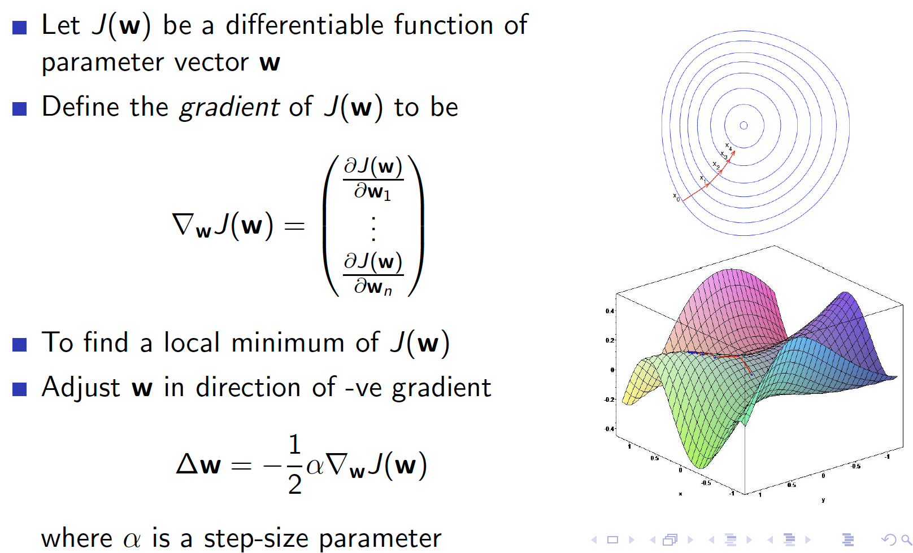

### SGD를 사용한 Value function approx.

- 목표(objective)  : 추정치 $\hat{v}(s, w)$와 실제 value $v_{\pi}(s)$ 사이의 MSE를 최소화하는 파라미터 벡터 w 찾기

- GD로 local minimum을 찾는다.

- SGD는 gradient 샘플링해서 구한다.

### Feature vectors
state를 feature 벡터로 표현해보자.   
예를 들어 n개의 피처가 있다면,,

이러한 표현의 예는 다음과 같다.  
- Distance of robot from landmarks
- Trends in the stock market
- Piece and pawn con gurations in chess

이제 다음부터 차례로 approximator를 하나씩 살펴보자.

### Linear Value Function Approximation

- value function을 피처의 선형 조합으로 표현한 것이다.

- Objective는 파라미터 w에 대해서 quadratic이다.

- quadratic이기 때문에 SGD는 global optimum에 도달한다.
- 업데이트 방법은 간단하다.

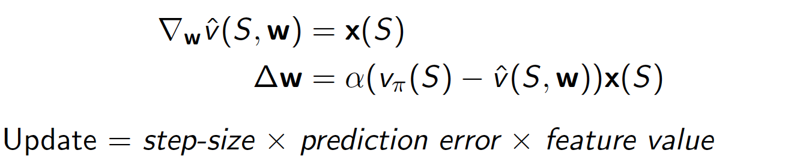

### Table Lookup Features
- table lookup 방식은 linear value function approximation의 special case이다.
- table lookup feature를 표현하면 다음과 같다.(즉 모두 1이다.)

- 그리고 parameter vector w는 각 state의 value 값이다.

### Incremental Prediction Algorithms
실제로는 True $v_\pi$를 모르기 때문에, $v_\pi$를 추정하기 위해 MC, TD를 사용한다???
이제 incremental prediction algorithm을 살펴보자
- True $v_\pi (s)$는 supervisor에 의해 주어진다고 가정한다.  
- 그런데 RL에서는 supervisor가 없고 rewards만 존재한다.
- 따라서 sgd를 계산할 때 $v_\pi (s)$를 대체할 타겟 값을 사용한다.
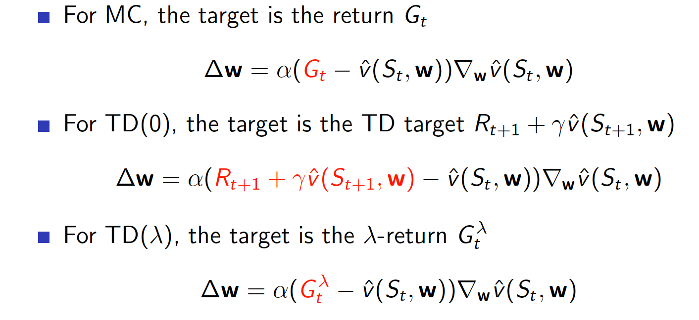

이제 각각 하나씩 살펴보자.

### MC with Value Function Approximation

- Return $G_t$는 true value $v_\pi$의 unbiased, noisy 샘플이다.
- 따라서 지도학습의 training data로 사용할 수있다.

- 예를 들어서 linear MC policy evaluation을 위해서 다음 식을 사용하는 것이다.

- 이 MC evaluation 방법은 local optimum에 수렴한다.
- 비선형 value function approximation에서도 잘 수렴한다.

### TD Learning with Value Function Approximation
- TD-target $R_{t+1} + \gamma \hat{v}(S_{t+1}, w)$은 $v_\pi$의 biased 된 샘플이다.
- 하지만 아직까지도 지도학습의 training data로 사용할 수있다.

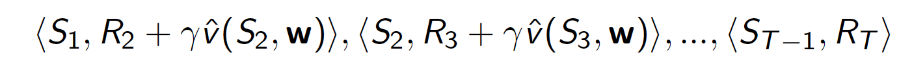

- 예를 들어 TD(0)에서는 다음과 같이 사용할 수 있다.

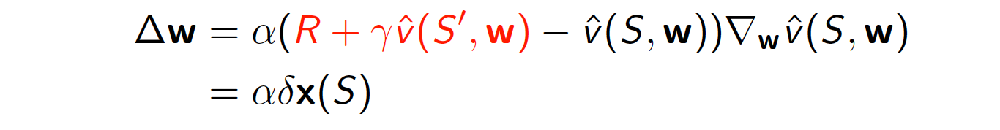

- Linear TD(0)를 사용하면 global optimum에 수렴한다.

### TD($\lambda$) with Value Function Approximation
.. 같은 내용
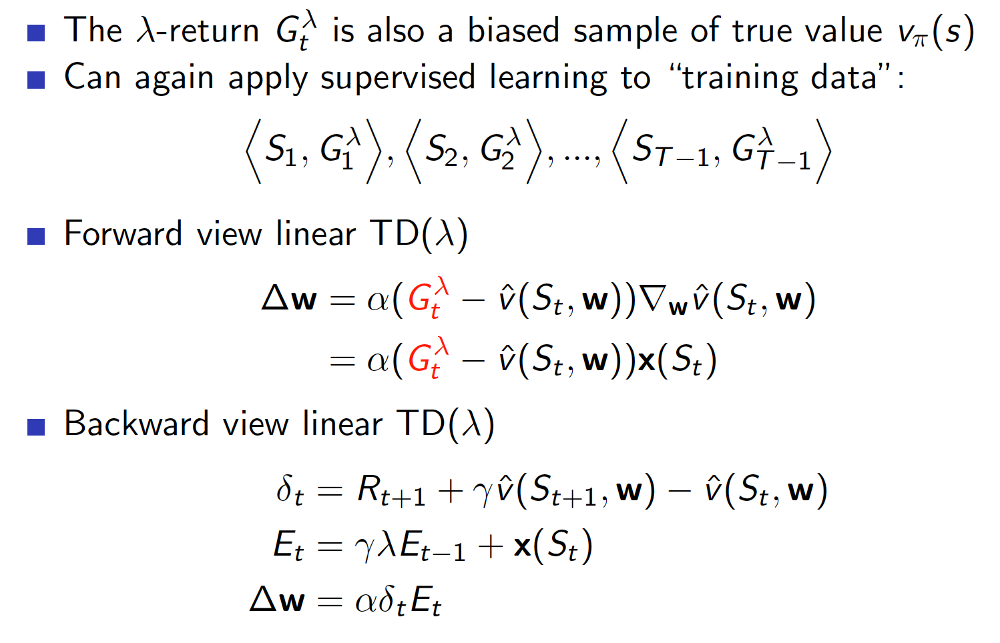

위에서 Forward view와 backward view linear TD($\lambda$)는 등가이다.

여기까지가 Incremental Prediction 알고리즘 들이다.
### Control with Value Function Approximation
이제 Incremental Control 알고리즘에 대해서 살펴보자.

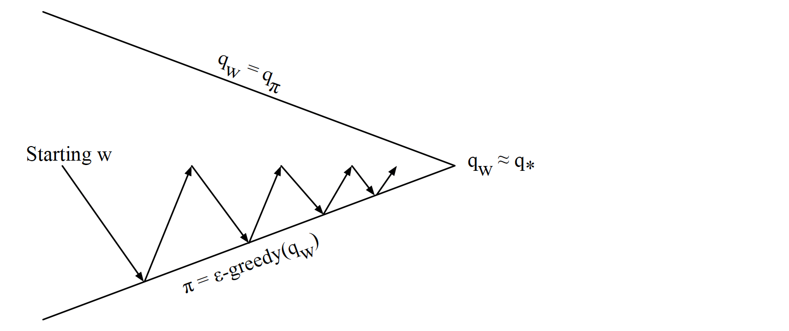

  결국 추정된 policy로 평가하고, $\epsilon$-greedy로 improvement하는 방법이다.
  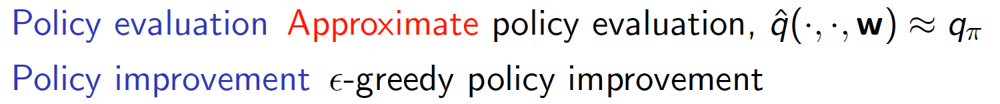

  ### Action-Value Function Approximation
  요약하면 v 대신 q를 사용하여 approxmate 하는 방식이다.
  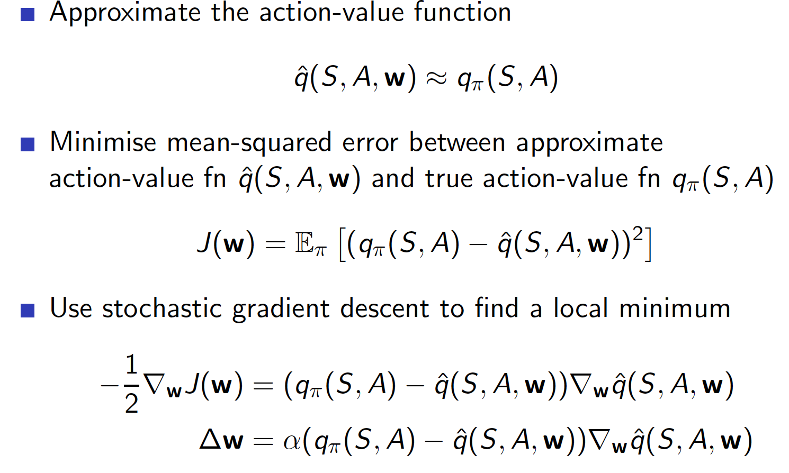

  ### Linear Action-Value Function Approximation

  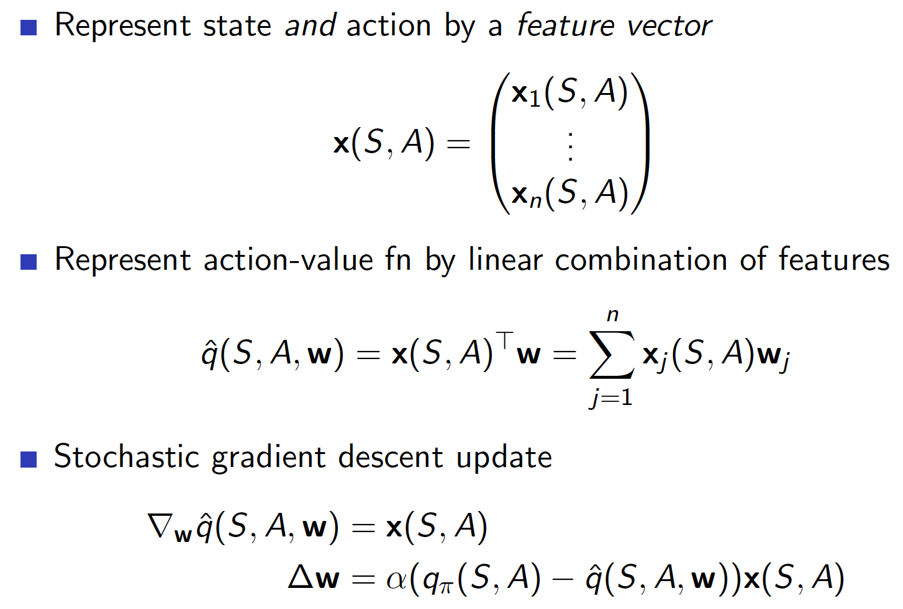

  ### Incremental Control Algorithm

  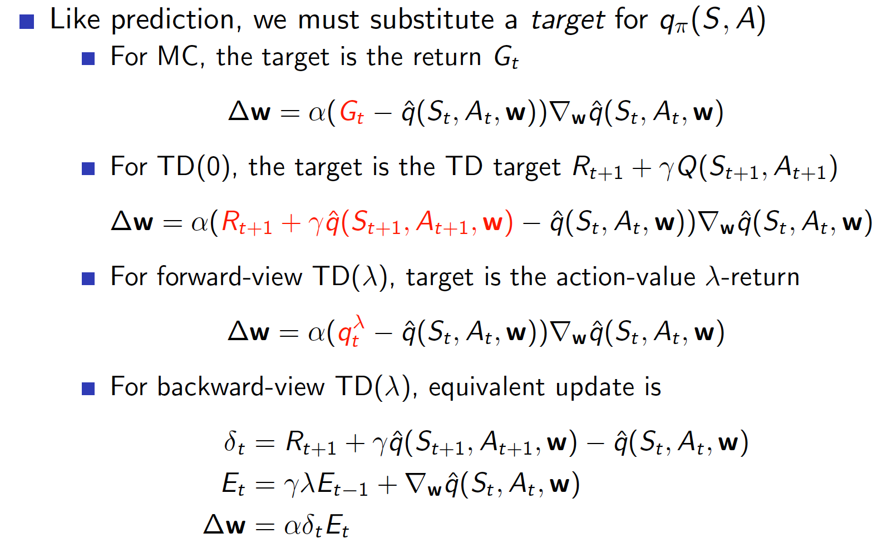

  ### Linear Sarsa with Coarse Coding in Mountiain Car

  이제 Model-free, 큰 문제에서 Function Approxmate로 문제를 푸는 방법을 알아보았다.  
  이 방법을 Linear Sarsa라고 한다.   

  아래의 Mountain car 문제의 결과를 살펴보자.
  - state : 2개(position, velocity)
  - action : 3개(앞, 뒤, 동작안함)

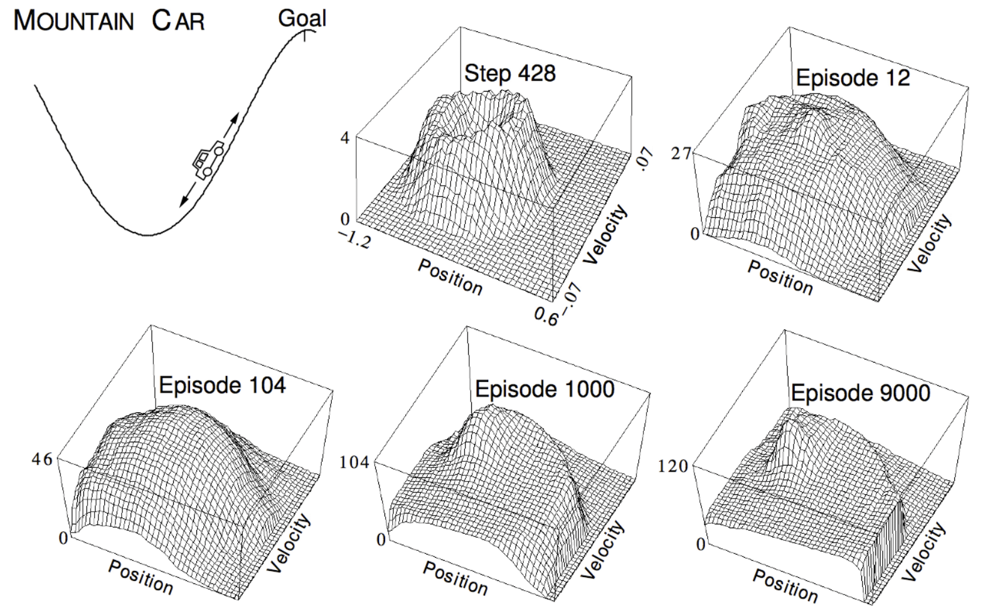

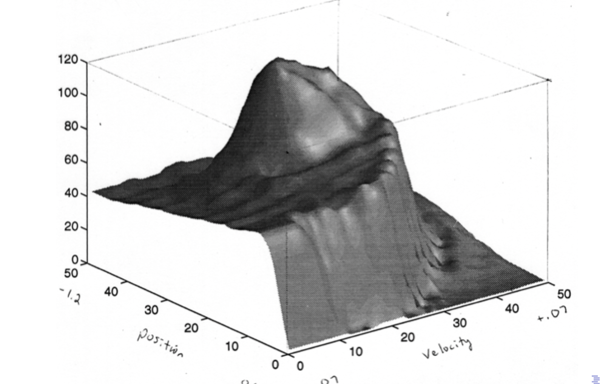

### Should We Bootstrap?
그러면 TD(0)만 사용해도 될까? 부트스트랩(TD($\lambda$))을 할 필요는 없을까???
아래의 여러가지 문제의 결과를 살펴보자.

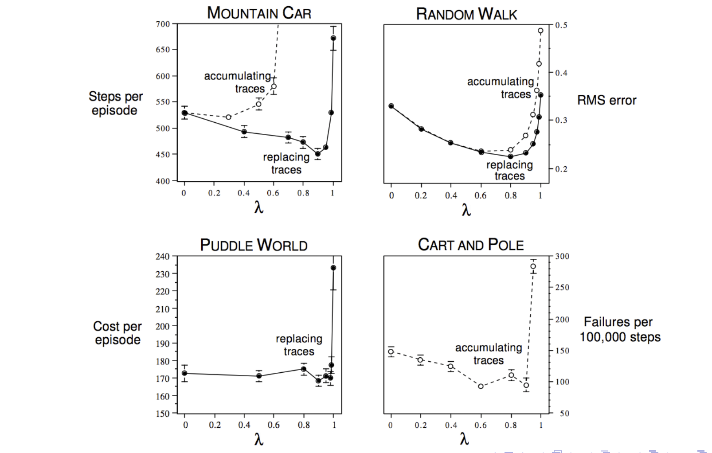

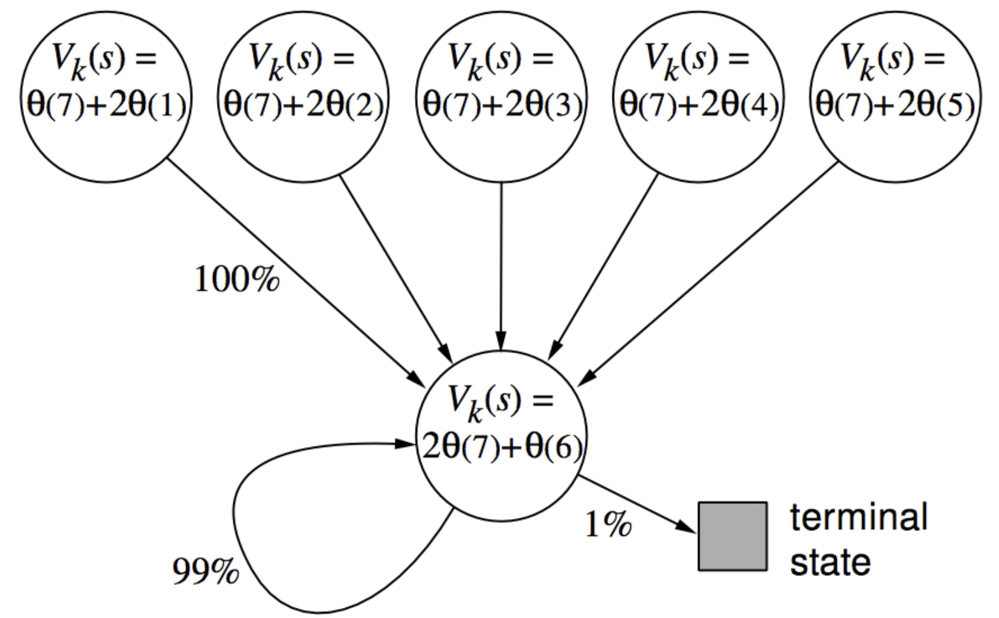

TD(0)이 항상 수렴하는 것은 아니다. 그렇지만 대부분 잘 동작한다.

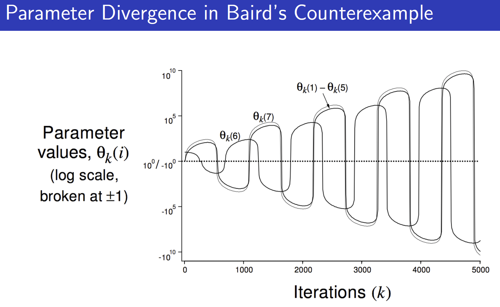

각 알고리즘과 approximator(table, linear, non-linear)에 따른 수렴 여부를 정리하면 다음과 같다.

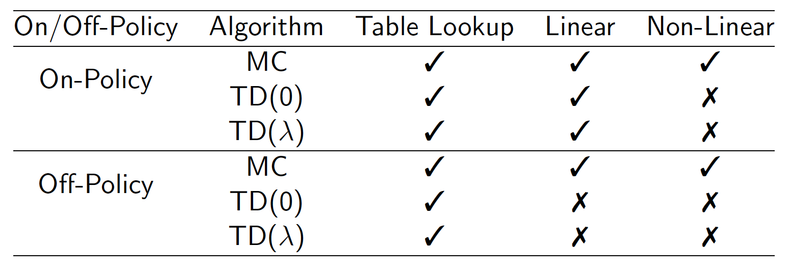

### Gradient Temporal-Difference Learning
그외에 David silver가 제안한 Gradient TD라는 것이 있는데 요즘에는 잘 사용하지 않는듯 하다.
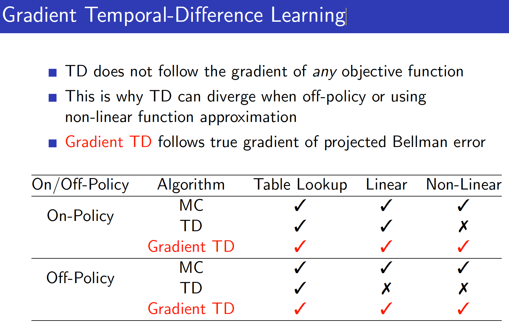

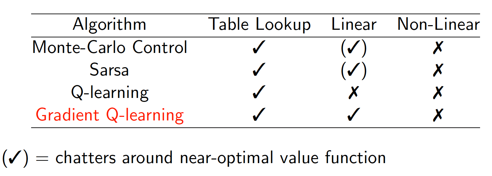

## 3. Batch Methods
### Batch Reinforcement Learning
- Gradient Descent는 간단하고 매력적인 방법이다.
- 하지만 샘플을 쓰고 버리므로 효과적으로 사용하지 았는다.(not sample efficient)
- Batch methods는 주어진 에이전트의 경험(학습 데이터)으로 부터 최적의 fitting value function을 찾는다.
- 즉, 경험을 쌓아 놓는다??

### Least Squares Prediction
- value function approximation이 다음과 같이 주어졌다면

$$\hat{v}(s, w) \approx v_{\pi}(s)$$
- 그리고 경험(학습 데이터) $D$가 <state, value> pair로 구성된다면

$$D = {<s_1, v_1^{\pi}>, <s_2, v_2^{\pi}>, ..., <s_T, v_T^{\pi}>}$$

- 어떤 파라미터 값 $w$가 best fitting value function $\hat{v}(s, w)$를 만들까?
- Least squares 알고리즘으로 타겟 $v_t^\pi$와 $\hat{v}(s, w)$의 sum-squared 에러를 최소화 하는 파라미터 벡터 $w$를 찾을 수 있다.

### Stochastic Gradient Descent with Experience Replay
- 경험(학습 데이터) $D$가 <state, value> pair로 주어졌다면

$$D = {<s_1, v_1^{\pi}>, <s_2, v_2^{\pi}>, ..., <s_T, v_T^{\pi}>}$$

다음을 반복한다.
- 1. 경험으로 부터 state, value를 샘플링한다.

$$<s, v^\pi> \sim D$$
-  2. stochastic gradient descent를 업데이트 한다.

이 것을 반복하면 least square solution에 수렴한다??

### Experience Replay in Deep Q-Networks (DQN)
DQN은 experience replay와 fixed Q-target 두가지를 사용한다.
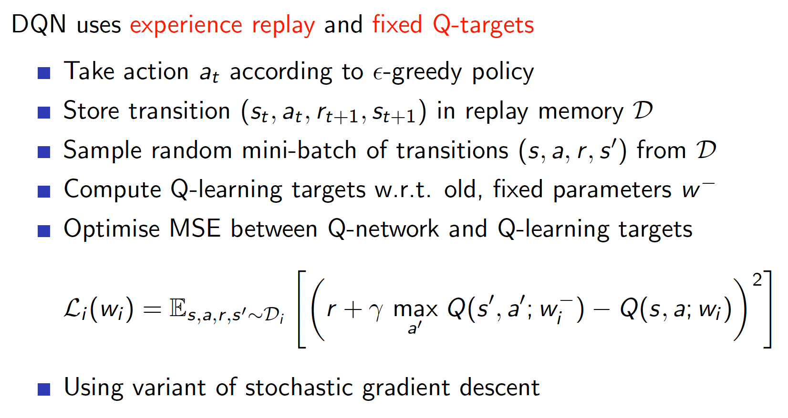

DQN을 아타리 게임에 적용했을 때...
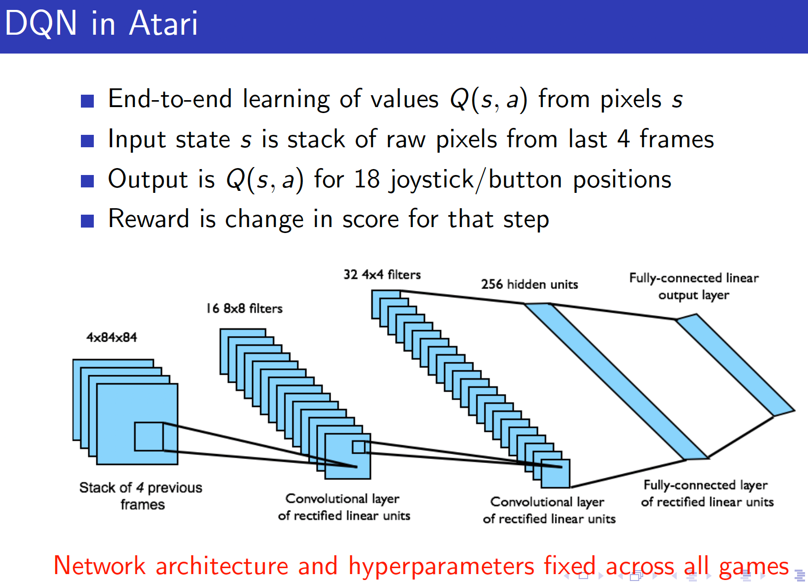
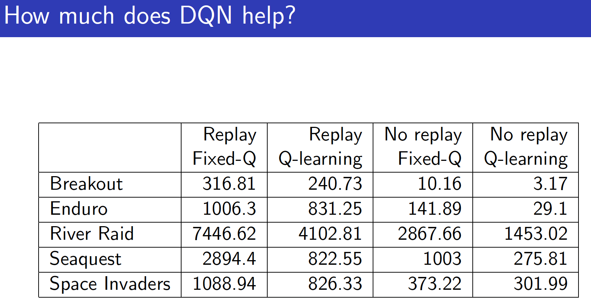

