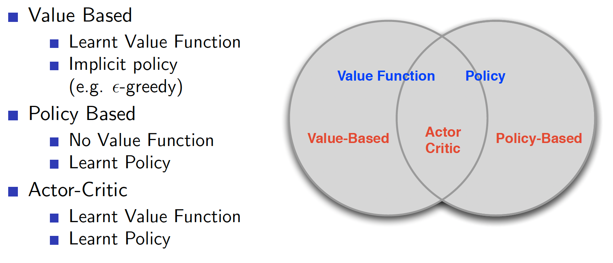
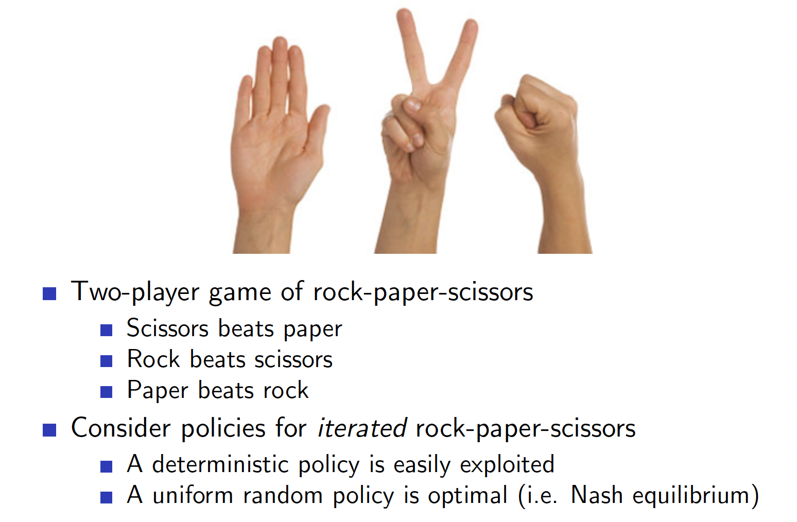
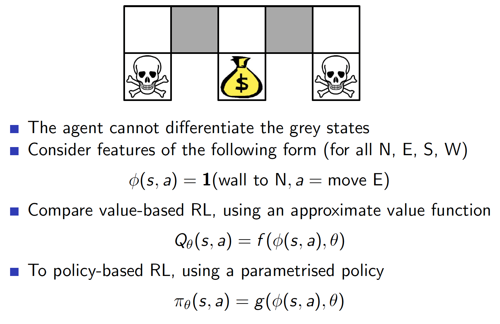
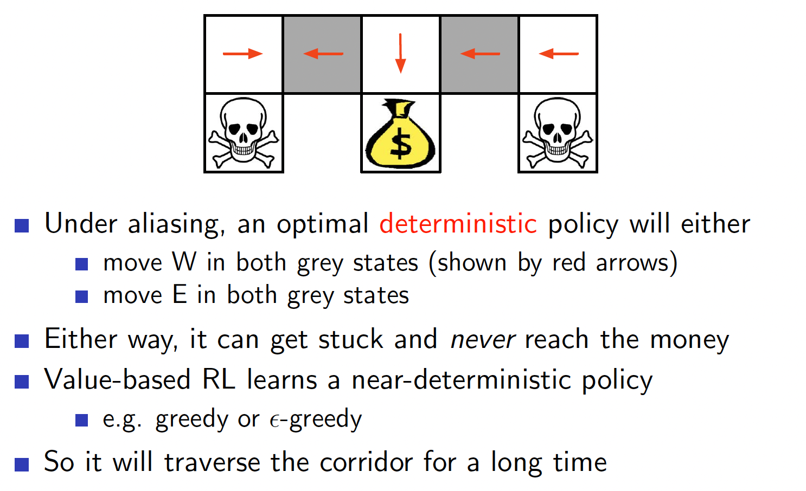
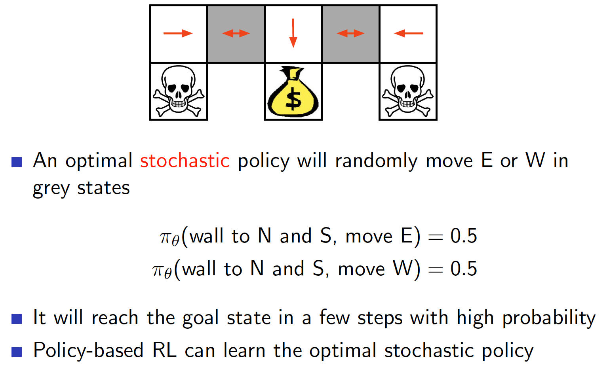

## Lecture 7. Policy Gradient
---

## 목 차
[1. Introduction]()  
[2. Finite Difference Policy Gradient]()  
[3. Monte-Garlo Policy Gradient]()
[4. Actor-Critic Policy Gradient]()

## 1. Introduction
- 앞에서 우리는 Value나 Action value function을 파라미터 $\theta$로 추청하능 방법을 배웠다.

- 최적의 policy는 value function으로부터 직접 생성할 수 있었다.
  - 예: $\epsilon$-greedy

- 본 장에서는 **policy**를 직접 파라미터화 한다.

- 여기서도 여전히 앞에서와 마찬가지로 model free 문제에 집중한다.

### Value 기반과 Policy 기반 강화학습
Model-Free RL 해결방법은 세가지로 분류할 수 있다.
- Value 기반(6장에서 배움)
  - Value Function을 학습
  - 이를 통해서 Implicit policy(ex: $\epsilon$-greedy를 구함)

- Policy 기반(7장)
  - Value Function 사용안함
  - Policy를 학습

- Actor-Critic(7장) : actor는 policy관련, critic은 value관련
  - Value function, Policy 둘다 학습

### Policy 기반 강화학습의 장점
Value 기반 방법이 있는데 Policy 기반 방법을 사용하는 이유는 무엇일까?

- 장점
  - 수렴성이 좋다.
  - 고차원, 또는 continuous action spaces에서 유용하다.(예: 0~1 사이이의 실수 action이 존재한다면)
  - 확률기반(stochastic) policy를 학습가능하다. (6장의 방법은 greedy policy를 선정하는 deterministic 방법이었다.)

- 단점
  - loca optimum에 빠지기 쉽다.
  - policy를 평가하는 방법이 비효율적이고 variance가 크다.
    - value 기반 방법은 매우 공격적인반면 stable하다.(내가 할수 있는 action 중에 max V를 취하는 것을 선택하므로)

### Example
그러면 stochastic policy가 필요한 이유는 무엇일까?  
- 가위가위보 게임
policy가 deterministic이면 상대방에게 알려지면 위험하다.   
결국 uniform random policy가 최적이다.  

- Aliased grid world

state가 partially observable한 상황이라고 가정하자.  
예를 들어 회색 부분의 피처가 불완전한 상황....

policy가 deterministic하면 회색 지점에 도달 했을떄 빠져나오지 못한다.

policy가 stochastic이면 회색 지점을 탈출할 수 있다.

