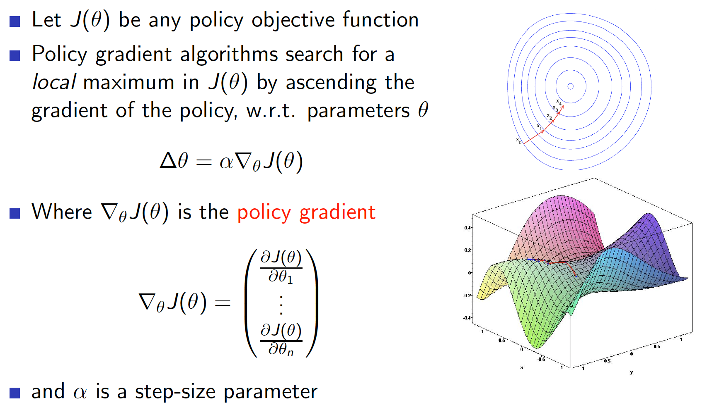
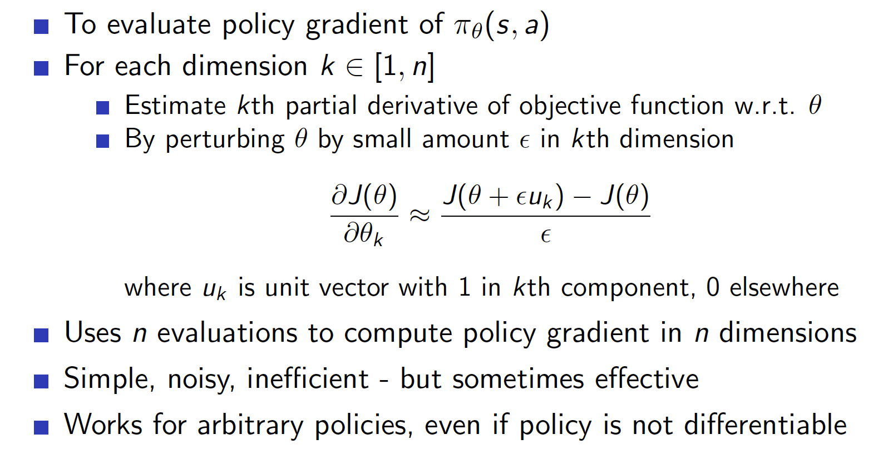
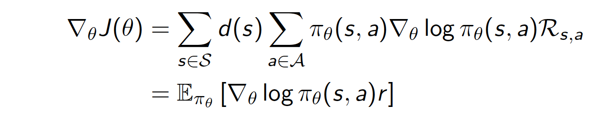
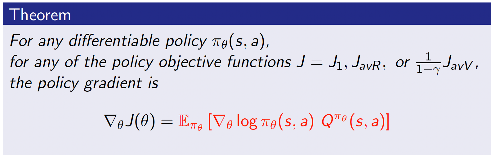
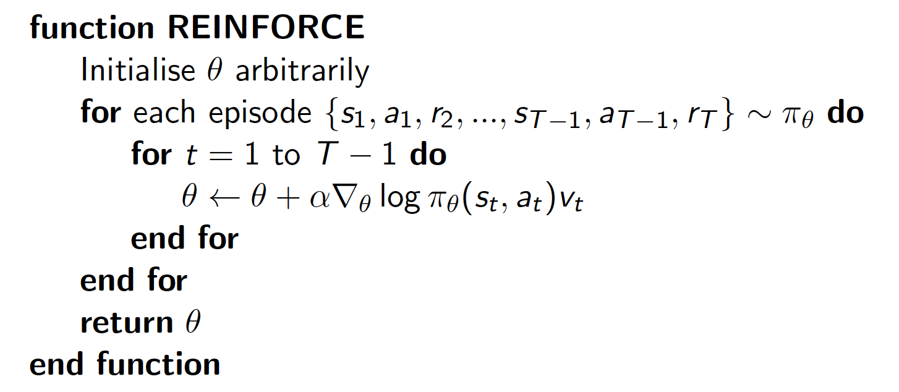
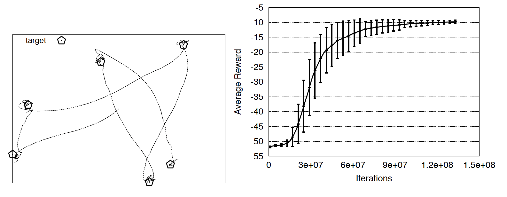

## Lecture 7. Policy Gradient
---

## 목 차
[1. Introduction]()  
[2. Finite Difference Policy Gradient]()  
[3. Monte-Garlo Policy Gradient]()
[4. Actor-Critic Policy Gradient]()

## 1. Introduction
- 앞에서 우리는 Value나 Action value function을 파라미터 $\theta$로 추청하능 방법을 배웠다.

- 최적의 policy는 value function으로부터 직접 생성할 수 있었다.
  - 예: $\epsilon$-greedy

- 본 장에서는 **policy**를 직접 파라미터화 한다.

- 여기서도 여전히 앞에서와 마찬가지로 model free 문제에 집중한다.

### Value 기반과 Policy 기반 강화학습
Model-Free RL 해결방법은 세가지로 분류할 수 있다.
- Value 기반(6장에서 배움)
  - Value Function을 학습
  - 이를 통해서 Implicit policy(ex: $\epsilon$-greedy를 구함)

- Policy 기반(7장)
  - Value Function 사용안함
  - Policy를 학습

- Actor-Critic(7장) : actor는 policy관련, critic은 value관련
  - Value function, Policy 둘다 학습

### Policy 기반 강화학습의 장점
Value 기반 방법이 있는데 Policy 기반 방법을 사용하는 이유는 무엇일까?

- 장점
  - 수렴성이 좋다.
  - 고차원, 또는 continuous action spaces에서 유용하다.(예: 0~1 사이이의 실수 action이 존재한다면)
  - 확률기반(stochastic) policy를 학습가능하다. (6장의 방법은 greedy policy를 선정하는 deterministic 방법이었다.)

- 단점
  - loca optimum에 빠지기 쉽다.
  - policy를 평가하는 방법이 비효율적이고 variance가 크다.
    - value 기반 방법은 매우 공격적인반면 stable하다.(내가 할수 있는 action 중에 max V를 취하는 것을 선택하므로)

### Example
그러면 stochastic policy가 필요한 이유는 무엇일까?  
- 가위가위보 게임
policy가 deterministic이면 상대방에게 알려지면 위험하다.   
결국 uniform random policy가 최적이다.  

- Aliased grid world

state가 partially observable한 상황이라고 가정하자.  
예를 들어 회색 부분의 피처가 불완전한 상황....

policy가 deterministic하면 회색 지점에 도달 했을떄 빠져나오지 못한다.

policy가 stochastic이면 회색 지점을 탈출할 수 있다.

### Policy Objective Functions
이제 최적의 policy를 찾기 위한 Policy objective function에 대해서 알아보자.
policy $\pi(s, a)$ state s에서 action a를 확률이다.  
그런데 우리는 파라미터 $\theta$로 구성된 $\pi_\theta(s, a)$ function approxmator를 사용할 것이다.

이제 RL문제의 목표는 다음과 같이 정의된다.
- 목표 : 주어진 policy $\pi_\theta(s, a)$에서 최적의 $\theta$ 찾기
- 그런데 $\pi_\theta$의 좋고 나쁨을 어떻게 측정해야 할까?
- 이를 위해 목적함수 J를 정의할 필요가 있다.
- 대표적인 J는 다음 세가지가 있다.
- 1) episodic 환경에서 우리는 start value를 쓸수 있다. 매번 같은 지점에서 시작하는 것은 아니지만... 따라서 다음과 같이 정의 가능하다.(예를 들어 pc 게임), 시작 state s1는 고정된 값일 필요는 없다. s1이 확률 분포여도 사용가능하다.

- 2) continuous 환경에서는 average value를 사용할 수 있다. 즉 해당 state에 위치할 확률 d에 해당 state의 value를 곱한 것을 모두 더한 것이다.

- 3) 또는 step 마다 average reward를 사용하여 J를 설정할 수도 있다.

여기서 $d^{\pi_\theta}(s)$는 policy $\pi_\theta$에 대한 stationary distribution이다.

### Policy optimization 
이제 J를 정의하는 방법에 대해서 알게되었다. 결국 policy 기반 RL은 최적화 문제이다.  
다시 말해 $J(\theta)$를 최대화 하는 $\theta$를 찾는 문제이다.
해를 찾는 방법은 다양한다. 우리는 gradient descent를 사용할 것이다.

## 2. Finite Difference Policy Gradient
### Policy Gradient
GD 방법은 앞에서 설정한 J를 policy objective function으로 두고 최대 지점을 찾는 것이다.  

### Computing Gradients By Finite Differences
최적 지점을 찾기 위한 가장 단순한 방법이 Finite Difference 방법이다.
만약 $\theta$의 차원이 n dimension이라면, 각 차원 마다 $\theta_k$를 조금씩 변경하여 편미분을 구하고 업데이트 하는 방법이다. 이러한 작업을 n번 반복한다.  
이 방법은 단순하지만, 노이즈에 민감하고 비효율적이다.  
그러나 policy가 미분가능하지 않아도 적용가능하다.  

그러나 이 방법은 요즘에 잘 사용되지 않고 있다....

## 3. Monte-Carlo Policy Gradient
### Score function
이제 policy gradient를 analytical하게 계산하는 방법을 살펴보자.   
- 먼저 policy $\pi_\theta$가 미분 가능하다고 가정하다.
- 그러면 policy의 gradient $\nabla_\theta \pi_\theta(s, a)$ 를 계산할있다.
- 그러면 likelihood ratio라는 트릭을 사용해서 gradient를 다음과 같이 표현이 가능하다.(로그변환 활용)

여기서 $\nabla_\theta log\pi_\theta(s, a)$를 score function이라고 한다.

### One-Step MDPs
이제 앞에서 살펴봤던 One-Step MDP를 살펴보자.  
한번만 진행하고 리워드 받은후 종료되는 프로세스이다.
- 정리하면 One-step MDP란  
  - 특정 분포 $d(s)$를 따르는 스테이트 s에서 시작해서
  - 한 time-step 진행후 리워드 $r = R_{s, a}$를 받고 종료하는 프로세스이다.
  - 예) 슬롯머신

이제 One-Step MDP의 policy objective function에 likelihood ratio를 적용해보자.  
objective funtion은 다음과 같다.

여기에 gradient를 적용하여 정리하면 아래와 같다.

여기서 $r$은 확률변수 $R_{s, a}$의 샘플링된 값이다.  
위 내용을 정리하자면, gradient가 기대값 형태로 표현되어서 단순한 샘플링을 통해서 구할 수 있게 되었다.  

### Softmax Policy
이번에는 policy가 softma인 경우를 살펴보자.  
그러면 weight action은 feature $\phi(s, a)$와 파라미터 $\theta$의 선형 조합인 $\phi(s, a)^T\theta$로 나타낼 수 있다.  
그리고 action의 확률은(policy) 가중치 지수에 비례한다???

그러면 score function은 다음과 같다.  

### Gaussian Policy
policy가 gaussian 형태인 경우를 살펴보자. gaussian policy는 평균적으로 $\mu(s)$의 action을 취하는데 분산 $\sigma^2$ 정도로 variance가 존재하는 것으로 이해하자.
- continuous action space에서는 gaussian policy가 일반적이다.
- 평균은 state feature들의 선형 조합이라고 하자 : $\mu(s) = \phi(S)^T\theta$
- 분산은 고정값 $\sigma^2$로 두자. 또는 파라미터로 표현할 수도 있다.  
- 그러면 policy는 가우시안이다. : $a ~ N(\mu(s), \sigma^2)$
- 이떄 score function은 다음과 같다.

### Policy Gradient Theorem
Policy gradient theorem은 앞의 one-step MDP의 예를 multi-step으로 확장하여 정리한 것이다.  
- Policy gradient theorem은 likelihood ratio 접근 법을 multi-step으로 일반화 한것이다.
- 이때 reward 자리에 있던 $r$을 long-term value $Q^\pi(s, a)$로 확장한 것이다.
- Policy gradient theoremdms object의 start state, average reward, average value object 세가지 모두에 적용 가능하다.

### Monte-Carlo Policy Gradient (REINFORCE)
이제 policy gradient를 사용한 대표적인 알고리즘을 알아보자. 
바로 MC를 적용한 REINFORCE라는 방법이다.  

- policy의 파라미터 $\theta$를 업데이터 하기위해 SGA(Ascent)를 사용한다.
- 이때 policy gradient theorem를 활용한다.
- 그런데 gradient를 계산하기 위한 Q를 알수없다. 따라서 $Q^{\pi_{\theta}}(s_t, a_t)$의 unbiased sample인 return $v_t$를 사용한다.

앞에서 정리의 Q자리에 $v_t$로 대체되었다.
아래 REINFORE 알고리즘을 살펴보자.  
초기에 $\theta$를 임의의 값으로 초기화 한다. 그러면 임의의 policy가 만들어 질 것이다.
이를 바탕으로($\pi_\theta$) 에피소드를 진행하면서 $\theta$를 업데이트 한다.

### Puck World Example

- 퍽에 작은 힘을 가에서 타겟에 집어넣는 문제이다. continuous action
- 퍽이 타겟에 가까울수록 큰 reward를 받는다.
- 타겟의 위치는 30초마다 리셋된다.
- policy는 REIFORCE 기반 방법으로 학습되었다.

오른쪽 평균 reward커브를 보면 곡선이 지그재그하지 않고 부드러운 곡선을 형성하고 있다.(policy 기반의 장점)  
그런데 수평축 iteration을 보면 수렴 속도가 매우 느린 것을 알 수있다.(variance가 크다.)   

이후에 variance를 줄이는 방법이 계속해서 등장한다.(ex: actor-critic)

## 4. Actor-Critic Policy Gradient
### Reducing Variance Using Critic
